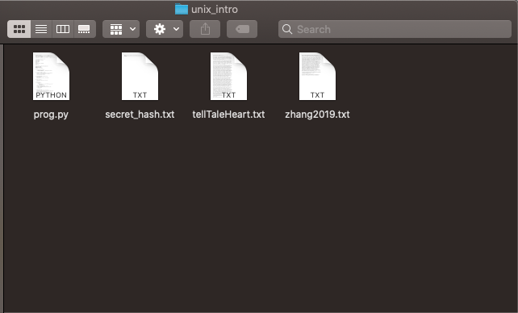

****************************
Creating Accessible Websites
****************************

============
Introduction
============

----------------------------------------
Motivating Example: Developing a Website
----------------------------------------

Design for People Like You
**************************

Imagine you are a software developer creating a new website. When you
browse the web, you:

* Use a laptop computer.
* Enter text into forms with a keyboard.
* Click on buttons and scroll with a trackpad.
* Consume web content visually.
* Are adept at reading and understanding lots of text.

When you create the website, you'll probably most naturally design for
users like you--users who browse the web the same way you do. I know I
probably would. After all, I understand my own experience better than I
can understand anyone else's.

Design for People Unlike You
****************************

If you want other people to use your website, though, you'll have to
design it for people who browse the web differently. Thankfully, web
technology supports this. For example, most major website you view today
will be compatible with the smaller screen sizes of mobile devices. If
you are viewing this guide online with a desktop or laptop computer, try
making your browser window narrower and watch the site adjust.

While most developers hear about designing websites for mobile devices,
designing websites for disabled users is much less prominent. Far too
many websites today are inaccessible for users with disabilities. This
may be why only 54% of disabled Americans use the internet, compared
with 81% of Americans without a disability, according to the `Pew
Research Center
<https://www.pewresearch.org/internet/2011/01/21/americans-living-with-disability-and-their-technology-profile/>`_.

If your website isn't accessible, disabled people might be forced to
look for alternative websites. According to the `World Bank
<https://www.worldbank.org/en/topic/disability>`_, 15% of the world have
a disability. That's a billion people who your website might not serve
effectively if it isn't accessible.

.. note::
   Don't let your website be one that is unusable for the many people
   with disabilities.

Just as you can design for people who use mobile devices, you can also
design for people with disabilities. For example, you can support:

* People with auditory disabilities by including transcriptions and
  captions for audio.
* People with cognitive or learning disabilities by clearly structuring
  your content and replacing long blocks of instructions with form
  labels.
* People with physical disabilities by letting users navigate with just
  a mouse or just a keyboard.
* People with speech disabilities by supporting text-based interactions
  as an alternative for any voice interactions.
* People with visual disabilities by providing text descriptions of
  visual content and ensuring your content is clear based on the text
  alone.

For more examples of barriers people face when using the web, see the
`Diverse Abilities and Barriers page of the Web Accessibility Initiative
(WAI) <https://www.w3.org/WAI/people-use-web/abilities-barriers/>`_.

----------------------
Theories of Disability
----------------------

There are `many theories of disability
<https://en.wikipedia.org/wiki/Disability_studies>`_, but here we'll
focus on two common ones:

* The `medical model
  <https://en.wikipedia.org/wiki/Medical_model_of_disability>`_ treats
  disability as a condition disabled people suffer from. Disabilities
  then are problems to be cured, often with adaptive technology. For
  example, the medical model would view blindness from a cataract as a
  medical problem to be fixed with `cataract surgery
  <https://www.mayoclinic.org/diseases-conditions/cataracts/diagnosis-treatment/drc-20353795>`_.
* On the other hand, the `social model
  <https://en.wikipedia.org/wiki/Social_model_of_disability>`_ treats
  disabilities as equally valid ways of being. From this perspective,
  the difficulties a blind person experiences interacting with the world
  are not because of any medical condition but rather a built
  environment that is not designed to accommodate them.

In this guide we'll focus on the social model and designing websites to
accommodate people who interact with the web in many different ways.
However, you should be aware that this is not the only way to think
about disabilities.

----------------
Universal Design
----------------

Once we accept the social model, our goal in designing accessible
website becomes that of `universal design
<https://en.wikipedia.org/wiki/Universal_design>`_. That is, we want to
create a website that is universally accessible no matter how someone
browses the web. This may seem like a tall order, but disability rights
advocates have worked hard to facilitate accessible design. Because of
their work, you can make your website much more accessible using
features already built into internet standards like HTML. The WAI has a
`fantastic guide for developing accessible websites
<https://www.w3.org/WAI/tips/developing/>`_ that you should definitely
take a look at.

This guide is far from a substitute for the full `Web Content
Accessibility Guidelines (WCAG)
<https://www.w3.org/WAI/standards-guidelines/#wcag2>`_, but it will
highlight some best practices.

==================================
Examples of Accessibile Web Design
==================================

---------------------------
Alternative Text for Images
---------------------------

Whenever you include an image in your website, include alternative text
for users who access your page with a sreen reader. HTML supports
alternative text like this:

.. code-block:: html

    

This image will be displayed like this:

        within a folder.

If you use your browser's HTML inspection feature (e.g. right-click and
choose ``Inspect Element`` in Firefox), you can see the alternative
text.

You can find more guidance for alternative text on images in the `WAI
Images tutorial <https://www.w3.org/WAI/tutorials/images/>`_.

-----------
Form Labels
-----------

HTML includes a lot of features to help make your website accessible,
but you have to use them! For example, you can use ``for`` and ``id``
atributes in ``label`` and ``input`` elements to help people navigate
your forms. For example:

.. code-block:: html

    <label for="phone">Phone Number</label>
    <input id="phone" type="text" pattern="^[0-9-() ]*$" name="phone">

Here's what that looks like once the HTML is rendered:

.. raw:: html

    <label for="phone">Phone Number</label>
    <input id="phone" type="text" pattern="^[0-9-() ]*$" name="phone">

.. note:: The rendered HTML above might not appear if you are viewing an
   offline version of this guide. When rendered, the HTML creates an
   input box next to a ``Phone Number`` label. If you type letters into
   the box, the border turns red to indicate invalid text was entered.

The ``for`` and ``id`` link the label to the input element to help tell
people which label goes with which element. As an added bonus, the
``pattern`` attribute lets you warn the user if they enter something
invalid. This can help users with cognitive or learning disabilities
fill out your forms correctly.

See the `WAI Labels tutorial
<https://www.w3.org/WAI/tutorials/forms/labels/>`_ for more guidance.

==========
Conclusion
==========

The standards that underpin the web include many features to make it
accessible to disabled people, but it's up to us as developers to
actually use them. I hope you leave this guide inspired and empowered to
make your websites accessible for everyone.

=========
Resources
=========

* This `Mixtape podcast on artificial intelligence and disability
  <https://techcrunch.com/2020/12/19/mixtape-podcast-artificial-intelligence-and-disability/>`_
  includes a helpful discussion on different theories of disability and
  how they have waxed and waned over time.
* The `Web Accessibility Initiative (WAI) <https://www.w3.org/WAI/>`_
  has great resources to help you make your website more accessible.

=========================
Licensing and Attribution
=========================

Copyright (c) 2021 `U8N WXD <https://u8nwxd.github.io>`_

This guide was informed by the World Wide Web Consortium (W3C) Web
Accessibility Initiative (WAI) `Developing for Web Accessibility guide
<https://www.w3.org/WAI/tips/developing/>`_ and `Diverse Abilities and
Barriers page
<https://www.w3.org/WAI/people-use-web/abilities-barriers/>`_.

.. image:: https://i.creativecommons.org/l/by/4.0/88x31.png
   :target: http://creativecommons.org/licenses/by/4.0/

This work is licensed under a `Creative Commons Attribution 4.0
International License <https://creativecommons.org/licenses/by/4.0/>`_.

This work was initially created for a workshop at
`Stanford Code the Change <https://www.codethechange.stanford.edu>`_ and
as a project for COMM 230A at `Stanford University
<https://stanford.edu>`_.
