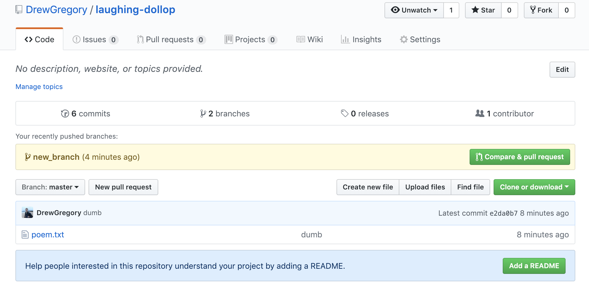
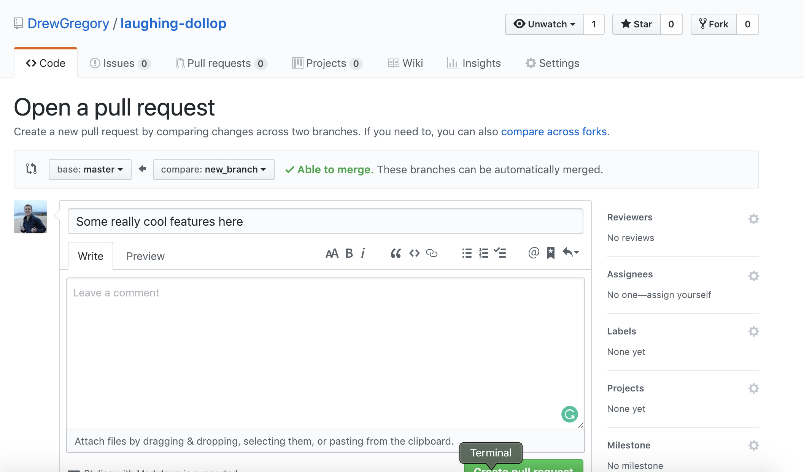

*********************************************************************
Gitting Around With Robert Frost: A Guide to Getting Started with Git
*********************************************************************

To learn Git properly, visit the actual documentation: https://git-scm.com/doc

=====
Setup
=====
First, install Git here: https://git-scm.com/downloads

Next, create a GitHub account: https://github.com/join

To make sure that you git works for you, open up a terminal
window and try the git command:

.. code-block:: console

    $ git
    usage: git [--version] [--help] [-C <path>] [-c <name>=<value>]
           [--exec-path[=<path>]] [--html-path] [--man-path] [--info-path]
           [-p | --paginate | --no-pager] [--no-replace-objects] [--bare]
           [--git-dir=<path>] [--work-tree=<path>] [--namespace=<name>]
           <command> [<args>]
    ... Even more console output ...

After that, config Git with your name and email from your GitHub account:

.. code-block:: console

    $ git config --global user.name "John Doe"
    $ git config --global user.email johndoe@example.com

Next, we will have to clone (download) our starter project, and move the ``poem.txt``
file to a new directory.

.. code-block:: console

    $ git clone https://github.com/codethechange/guide_starters
    $ mkdir git_practice
    $ mv guide_starters/git/poem.txt git_practice
    $ cd git_practice
    $ cat poem.txt
    Stopping By Woods On A Snowy Evening

        By Robert Lee Frost
    ...

**Irrelevant note:** Definitely check out `Steve Jackson's
<http://pages.cs.wisc.edu/~sjackso/sepoem.html>`_ version of this poem.

============================
Motivation - Too Many Drafts
============================

Let's pretend that you came up with this poem in ``poem.txt``.
This stanza took more than one take, however. In reality, you pored over each line many times.
Now, imagine you want to make some improvements to the poem.
You want to save this version of the draft, but don't want to lose your previous draft. What do you recommend? A common
approach is to save a new file with a new name, perhaps ``poemv2.txt``. As you become
increasingly involved in the writing process, you will realize that this mode of 
saving drafts will become unwieldy quickly. The directory will quickly balloon to include
``poemv25.txt``, ``poemfinal.txt``, ``realpoemfinal.txt``, ``poemfinalv2.txt``, and so on.
All of these files will have lots of redundant information, and it is tricky to organize 
and label your files so that you know both the chronological ordering of each version and 
what you accomplished in each version.

This is where Git begins to save the day.

===================================================
The Necessities: Committing, Branching, and Merging
===================================================

---------------
Getting Started
---------------

Git stores all version histories of your project directory (which we will now call a
**repository**) while still allowing you be viewing files in only one version at a time.

To make a your directory a repository, run the following command:

.. code-block:: console

    $ ls -a
    .		..		poem.txt
    $ git init
    Initialized empty Git repository in ...
    $ ls -a
    .		..		.git		poem.txt
    $ git log
    fatal: your current branch 'master' does not have any commits yet

``git init`` created a hidden directory named ``.git`` in your folder. Thus, you have a
repository. Congratulations! Unfortunately, we haven't added any versions yet.

**DO NOT touch that .git folder. EVER. Your .git folder is like a museum :-)**

----------
Committing
----------

Each version is called a **commit**. In fact, Git stores only the *changes* between
each version in a commit. As such, you can even choose which changed files you want
to include in a commit. This is called **staging**. For now, we will add
all changed files into the staging area for a commit. To learn about 
how to ignore files, read `this
<https://git-scm.com/docs/gitignore>`_.

.. code-block:: console

    $ git add .

This adds all files that have been changed (which is poem.txt, since we are
creating art from the void) were added into the staging area. Let's commit them now.

.. code-block:: console

    $ git commit -m "first commit"
    [master (root-commit) 7487f1b] first commit
    1 file changed, 25 insertions(+)
    create mode 100644 poem.txt
    $ git log
    commit 25e813bb0f8d4250c207af099700359e57709e30 (HEAD -> master)
    Author: DrewGregory <djgregny@gmail.com>
    Date:   Thu Jan 31 02:07:31 2019 -0800

        First commit

Now, our first revision. To be even more descriptive, make the last line "And miles to go
before I sleep well."

Don't think that Git didn't notice:

.. code-block:: console

    $ git status
    On branch master
    Changes not staged for commit:
    (use "git add <file>..." to update what will be committed)
    (use "git checkout -- <file>..." to discard changes in working directory)
        modified:   poem.txt
    no changes added to commit (use "git add" and/or "git commit -a")

In fact, we can even see the changes that were made line-by-line:

.. code-block:: console

    $ git diff
    diff --git a/poem.txt b/poem.txt
    index 33148d6..5b6adeb 100644
    --- a/poem.txt
    +++ b/poem.txt
    @@ -22,4 +22,4 @@ Of easy wind and downy flake.
    The woods are lovely, dark, and deep,
    But I have promises to keep,
    And miles to go before I sleep,
    -And miles to go before I sleep.
    +And miles to go before I sleep well.

Let's stage (``git add``) and commit (``git commit``) this change:

.. code-block:: console

    $ git add .
    $ git commit -m "new ending"
    [master 7a665a6] new ending
    1 file changed, 1 insertion(+), 1 deletion(-)

Notice that the commit only stores what files are changed and which lines are changed for
each file.

Now, we are going to experiment with this poem. We will tackle two approaches: 
changing the tone and accompanying the poem with some ASCII art. We want to work
on each experiment separately and somewhat asynchronously ...

---------
Branching
---------

A branch is a sequence of commits representing some approach to a project. In general,
a branch represents some feature that you want to add to a project. By default, every
repository has a *master* branch. Don't know which branch you're on? Just check:

.. code-block:: console

    $ git status
    On branch master
    nothing to commit, working tree clean

Now, let's create a new branch:

.. code-block:: console

    $ git checkout -b italian
    Switched to a new branch 'italian'

``git checkout`` is a command for switching branches. This will modify all the (tracked) files 
in your repository to reflect the version you are checking out. The ``-b`` flag signifies that
we want to make a new branch with the following name. In this case, our new branch's files
will be duplicates of the branch we were on before until we make our first commit on this branch.
To experiment with a change in tone, replace "snow" with "dough" and "woods" with "pizzas". 

.. code-block:: console

    $ cat poem.txt 
    Stopping By Pizzas On A Doughy Evening

        By Robert Lee Frost

    Whose pizzas these are I think I know.
    His house is in the village, though;
    He will not see me stopping here
    To watch his pizzas fill up with dough.

    My little horse must think it's queer
    To stop without a farmhouse near
    Between the pizzas and frozen lake
    The darkest evening of the year.

    He gives his harness bells a shake
    To ask if there's some mistake.
    The only other sound's the sweep
    Of easy wind and downy flake.

    The pizzas are lovely, dark, and deep,
    But I have promises to keep,
    And miles to go before I sleep,
    And miles to go before I sleep well.
    $ git add .
    $ git commit -m "snow->dough, woods->pizzas"
    [italian bc452ff] snow->dough, woods->pizzas
    1 file changed, 5 insertions(+), 5 deletions(-)

Let's now explore what ascii art can do to the poem. We want to experiment with art
separately from our food-centered shift, however, so we want to branch off the original poem.

.. code-block:: console

    $ git checkout master
    Switched to branch 'master'
    $ git checkout -b ascii_art
    Switched to a new branch 'ascii_art'

Now, insert this ascii art:

.. code-block:: console

    $ cat poem.txt
    Stopping By Woods On A Snowy Evening ...

        By Robert Lee Frost
                \/
            _\_\/\/_/_
             _\_\/_/_
            __/_/\_\__
             / /\/\ \
                /\

    Whose woods these are I think I know.
    His house is in the village, though;
    He will not see me stopping here
    To watch his woods fill up with snow.

    My little horse must think it's queer
    To stop without a farmhouse near
    Between the woods and frozen lake
    The darkest evening of the year.

    He gives his harness bells a shake
    To ask if there's some mistake.
    The only other sound's the sweep
    Of easy wind and downy flake.

    The woods are lovely, dark, and deep,
    But I have promises to keep,
    And miles to go before I sleep,
    And miles to go before I sleep well.
    $ git add .
    $ git commit -m "added a snowflake"
    [ascii_art 18b593a] added a snowflake
    1 file changed, 7 insertions(+), 2 deletions(-)

Fantastic! After much thought, you think the poem could both use some italian integration
and some ascii eye candy (perhaps the snowflake goes with 'Frost?'). Since the ``master`` branch 
should generally represent production-ready code, let's **merge** the ``ascii_art`` and ``italian`` 
branches into the ``master`` branch so
that commits from both branches end up in the master branch. In order to do so, first ``git checkout``
*into* the branch that you want the code to end up, and ``git merge`` *from* the branch that you
want to get code. In this example, we want text from our feature branches to end up in the ``master`` branch.

.. code-block:: console

    $ git checkout master
    Switched to branch 'master'
    $ git merge ascii_art
    Updating 7a665a6..18b593a
    Fast-forward
    poem.txt | 9 +++++++--
    1 file changed, 7 insertions(+), 2 deletions(-)
    $ cat poem.txt
    Stopping By Woods On A Snowy Evening ...

        By Robert Lee Frost
                \/
            _\_\/\/_/_
            _\_\/_/_
            __/_/\_\__
            / /\/\ \
                /\

    Whose woods these are I think I know.
    His house is in the village, though;
    He will not see me stopping here
    To watch his woods fill up with snow.

    My little horse must think it's queer
    To stop without a farmhouse near
    Between the woods and frozen lake
    The darkest evening of the year.

    He gives his harness bells a shake
    To ask if there's some mistake.
    The only other sound's the sweep
    Of easy wind and downy flake.

    The woods are lovely, dark, and deep,
    But I have promises to keep,
    And miles to go before I sleep,
    And miles to go before I sleep well.
    $ git log
    commit 18b593a108fea601d9213fb9e9146f161710d9a3 (HEAD -> master, ascii_art)
    Author: DrewGregory <djgregny@gmail.com>
    Date:   Thu Jan 31 23:45:39 2019 -0800

        added a snowflake

    commit 7a665a68bbc8aa8634940f5e2b7f9b0237860ec9
    Author: DrewGregory <djgregny@gmail.com>
    Date:   Thu Jan 31 13:25:53 2019 -0800

        new ending

    commit 25e813bb0f8d4250c207af099700359e57709e30
    Author: DrewGregory <djgregny@gmail.com>
    Date:   Thu Jan 31 02:07:31 2019 -0800

        First commit

If you have tried merging before, that may have felt *too* easy. ``master`` suddenly has
the 'added a snowflake' commit from ``ascii_art``, andthe file was updated. The `developers of Git
<https://en.wikipedia.org/wiki/Linus_Torvalds>`_ were quite smart, so Git will handle most
of file merging fort you. How do they
merge changes on the same line, you ask? Well, let's see.

.. code-block:: console

    $ git merge italian
    Auto-merging poem.txt
    CONFLICT (content): Merge conflict in poem.txt
    Automatic merge failed; fix conflicts and then commit the result.

In other words, Git can't. You have to resolve them yourself. I don't know you, but when I first
encountered this console response, my first response was ...

*Panic. Give up. Believe that understanding Git is hopeless. Just walk away.*

If this was your original response as well, I understand, but don't worry. Let's just see
what happened to poem.txt.

.. code-block:: console

    $ cat poem.txt
    <<<<<<< HEAD
    Stopping By Woods On A Snowy Evening ...
    =======
    Stopping By Pizzas On A Doughy Evening
    >>>>>>> italian

        By Robert Lee Frost
                \/
            _\_\/\/_/_
            _\_\/_/_
            __/_/\_\__
            / /\/\ \
                /\

    Whose pizzas these are I think I know.
    His house is in the village, though;
    He will not see me stopping here
    To watch his pizzas fill up with dough.

    My little horse must think it's queer
    To stop without a farmhouse near
    Between the pizzas and frozen lake
    The darkest evening of the year.

    He gives his harness bells a shake
    To ask if there's some mistake.
    The only other sound's the sweep
    Of easy wind and downy flake.

    The pizzas are lovely, dark, and deep,
    But I have promises to keep,
    And miles to go before I sleep,
    And miles to go before I sleep well.

Note the only weird modification is the top part of the file. Both branches modified the first line,
so Git merely displays which branch had which line and expects you to modify the file manually to choose
the version you want. The area between ``<<<<<<< HEAD`` and ``=======`` is the section that the
our current branch (``master``) had, and the area between ``=======`` and ``italian`` is what
the ``italian`` branch contained. Again, *manually* edit the file to produce the combined result 
you would like. In other words:

.. code-block:: console

    $ cat poem.txt
    Stopping By Woods On A Doughy Evening ...

        By Robert Lee Frost
                \/
            _\_\/\/_/_
            _\_\/_/_
            __/_/\_\__
            / /\/\ \
                /\

    Whose pizzas these are I think I know.
    His house is in the village, though;
    He will not see me stopping here
    To watch his pizzas fill up with dough.

    My little horse must think it's queer
    To stop without a farmhouse near
    Between the pizzas and frozen lake
    The darkest evening of the year.

    He gives his harness bells a shake
    To ask if there's some mistake.
    The only other sound's the sweep
    Of easy wind and downy flake.

    The pizzas are lovely, dark, and deep,
    But I have promises to keep,
    And miles to go before I sleep,
    And miles to go before I sleep well.
    $ git diff
    diff --cc poem.txt
    index fe9857e,5d4494f..0000000
    --- a/poem.txt
    +++ b/poem.txt
    @@@ -1,18 -1,13 +1,18 @@@
    diff --cc poem.txt
    index fe9857e,5d4494f..0000000
    --- a/poem.txt
    +++ b/poem.txt
    @@@ -1,18 -1,13 +1,18 @@@
    - Stopping By Woods On A Snowy Evening ...
    -Stopping By Pizzas On A Doughy Evening
    ++Stopping By Woods On A Doughy Evening ...
        By Robert Lee Frost
    -
    +            \/
    +        _\_\/\/_/_
    +         _\_\/_/_
    +        __/_/\_\__
    +         / /\/\ \
    +            /\
    - Whose woods these are I think I know.
    + Whose pizzas these are I think I know.
    His house is in the village, though;
    He will not see me stopping here
    $ git add .
    $ git commit -m "merged successfully"
    [master f9dca7a] merged successfully
    $ git log
    commit f9dca7a219e1e6341195d244bc6fbc428a13c724 (HEAD -> master)
    Merge: 18b593a bc452ff
    Author: DrewGregory <djgregny@gmail.com>
    Date:   Fri Feb 1 00:42:13 2019 -0800

        merged successfully

    commit 18b593a108fea601d9213fb9e9146f161710d9a3 (ascii_art)
    Author: DrewGregory <djgregny@gmail.com>
    Date:   Thu Jan 31 23:45:39 2019 -0800

        added a snowflake

    commit bc452fff1fb50f6972128597988384f4c90054af (italian)
    Author: DrewGregory <djgregny@gmail.com>
    Date:   Thu Jan 31 14:27:08 2019 -0800

        snow->dough, woods->pizzas

    commit 7a665a68bbc8aa8634940f5e2b7f9b0237860ec9
    Author: DrewGregory <djgregny@gmail.com>
    Date:   Thu Jan 31 13:25:53 2019 -0800
    

To visualize this, there's a really cool graph command (credits to `U8NWXD
<https://github.com/U8NWXD>`_ for showing me this):

.. code-block:: console

    $ git log --graph --abbrev-commit --decorate --all
    *   commit f9dca7a (HEAD -> master)
    |\  Merge: 18b593a bc452ff
    | | Author: DrewGregory <djgregny@gmail.com>
    | | Date:   Fri Feb 1 00:42:13 2019 -0800
    | | 
    | |     merged successfully
    | | 
    | * commit bc452ff (italian)
    | | Author: DrewGregory <djgregny@gmail.com>
    | | Date:   Thu Jan 31 14:27:08 2019 -0800
    | | 
    | |     snow->dough, woods->pizzas
    | | 
    * | commit 18b593a (ascii_art)
    |/  Author: DrewGregory <djgregny@gmail.com>
    |   Date:   Thu Jan 31 23:45:39 2019 -0800
    |   
    |       added a snowflake
    | 
    * commit 7a665a6
    | Author: DrewGregory <djgregny@gmail.com>
    | Date:   Thu Jan 31 13:25:53 2019 -0800
    |

=========================================================================
The Necessities: Pushing, Pulling, and Pull Requests with GitHub
=========================================================================

-------
Remotes
-------

With your newfound Git skills, you may find some other project buddies. Indeed, merging 
and branching only locally may feel somewhat unnecessary when most ordinary humans work on only
one task at a time. Git branching and merging achieves its full form in the context of
collaborating on software projects.

First, let's host this repo (slang for repository: yeah I'm cool) on GitHub. You should have an account
by this point, so sign in and create a new repository. Next, let's add a **remote** to your local repository
on your computer, which allows you to associate your local repository with your hosted repo on GitHub.

.. code-block:: console

    $ git remote -v
    $ git remote add origin https://github.com/<GitHub username>/<repo name>.git
    $ git remote -v
    origin	https://github.com/<GitHub username>/<repo name>.git (fetch)

-------
Pushing
-------

Now, we can send commits on branches (**push**) to our hosted GitHub repo.

.. code-block:: console

    $ git push -u origin master
    Counting objects: 15, done.
    Delta compression using up to 4 threads.
    Compressing objects: 100% (10/10), done.
    Writing objects: 100% (15/15), 3.54 KiB | 906.00 KiB/s, done.
    Total 15 (delta 4), reused 0 (delta 0)
    remote: Resolving deltas: 100% (4/4), done.
    To https://github.com/DrewGregory/laughing-dollop.git
    * [new branch]      master -> master
    Branch 'master' set up to track remote branch 'master' from 'origin'

Let's break down this command: ``git push <remote> <branch>``. If the branch does not already existed on the hosted
repository, you have to add the ``-u`` flag (which means `set upstream
<https://git-scm.com/book/en/v2/Git-Branching-Remote-Branches>`_). That's about it! You should be able to see
your commits on the hosted GitHub repo.

-------
Pulling
-------

Have a friend push some commits on your branch (alternatively, clone the repo yourself in a separate directory, 
commit your changes, and push them). To get the commits from the remote branch. Run this command:

.. code-block:: console

    $ git pull
    remote: Enumerating objects: 5, done.
    remote: Counting objects: 100% (5/5), done.
    remote: Compressing objects: 100% (1/1), done.
    remote: Total 3 (delta 1), reused 3 (delta 1), pack-reused 0
    Unpacking objects: 100% (3/3), done.
    From https://github.com/DrewGregory/laughing-dollop
    f9dca7a..e2da0b7  master     -> origin/master
    Updating f9dca7a..e2da0b7
    Fast-forward
    poem.txt | 2 +-
    1 file changed, 1 insertion(+), 1 deletion(-)

What if you want to checkout a branch on the remote repo that does not yet exist locally? Use ``git fetch``:

.. code-block:: console

    $ git fetch
    remote: Enumerating objects: 5, done.
    remote: Counting objects: 100% (5/5), done.
    remote: Compressing objects: 100% (1/1), done.
    remote: Total 3 (delta 1), reused 3 (delta 1), pack-reused 0
    Unpacking objects: 100% (3/3), done.
    From https://github.com/DrewGregory/laughing-dollop
    * [new branch]      new_branch -> origin/new_branch
    $ git checkout new_branch
    Branch 'new_branch' set up to track remote branch 'new_branch' from 'origin'.
    Switched to a new branch 'new_branch'

-------------
Pull Requests
-------------

First, let me say that Pull Requests have nothing to do with ``git pull``. There. I said it. Now let's move on.

A great model for collaboration is to work on individual features (which means make a new branch from ``master`` or some other 
major branch) and then submita a pull request to merge the feature branch back into the major branch. GitHub even expects me
to do so:

Now, you can elaborate on what your PR (other cool slang for Pull Request) accomplishes.

Ideally, other members will review your pull requests, give you feedback, and merge when finished.

Sometimes the branches will have merge conflicts. GitHub has an interface where you can manually resolve
them in the same way we did locally. alternatively, you can merge the major branch (``master`` in this case)
into your feature branch (``new_branch``) *before* submitting the PR, which will guarantee that there will
be no conflicts on GitHub. Yes, this merging is the inversion of the Pull Request merge.

============
Fancy Tricks
============

---------------------
Undoing Your Mistakes
---------------------
To be frank: this `post
<https://github.blog/2015-06-08-how-to-undo-almost-anything-with-git/>`_ will explain
undoing things in Git better than I can.

---------------
Signing Commits
---------------
Another `link
<https://git-scm.com/book/en/v2/Git-Tools-Signing-Your-Work>`_.

=========================
Licensing and Attribution
=========================

Copyright (c) Drew Gregory (https://github.com/DrewGregory) <djgregny@gmail.com>

|CC-0 license|

.. |CC-0 license| image:: https://i.creativecommons.org/l/by/4.0/88x31.png
   :target: http://creativecommons.org/licenses/by/4.0/

This work, including both this document and the source code in the associated
GitHub repository, is licensed under a `Creative Commons Attribution 4.0
International License <https://creativecommons.org/licenses/by/4.0/>`_.

This work was initially created for a workshop at
`Stanford Code the Change <http://www.codethechange.stanford.edu>`_.
