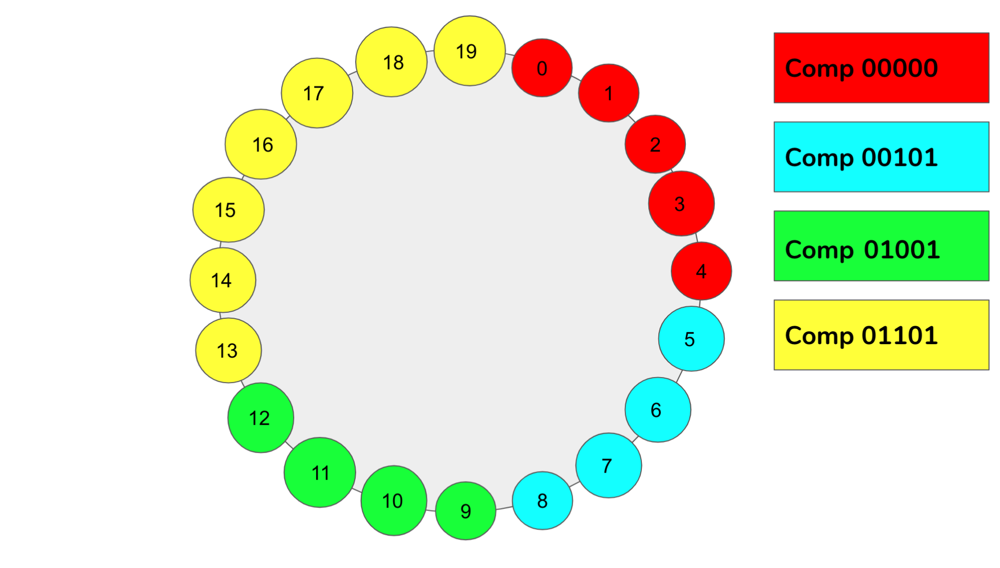
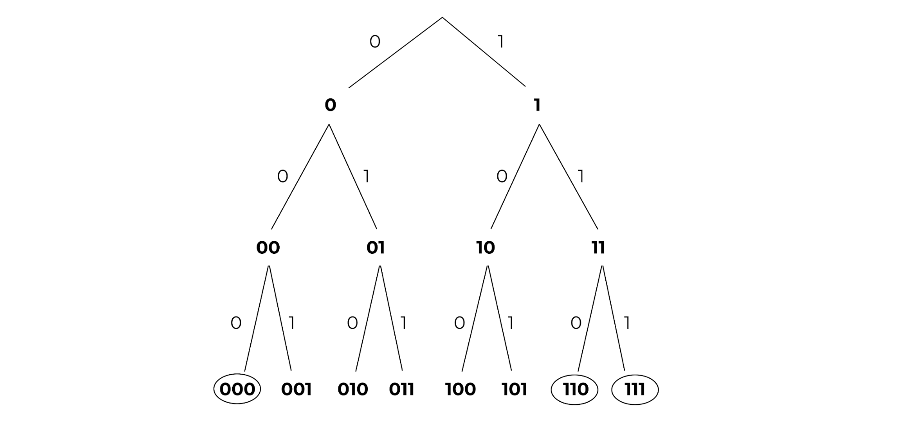
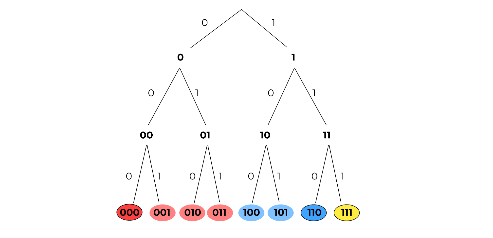
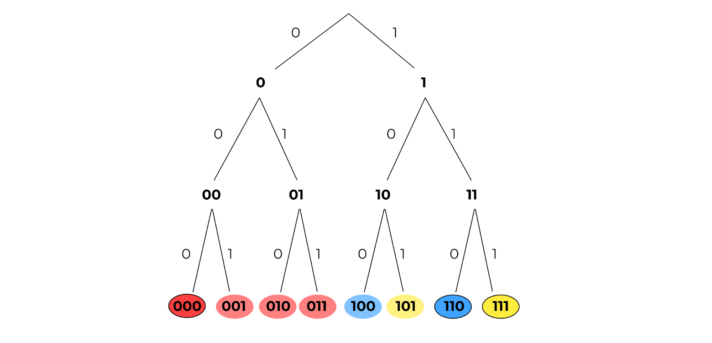
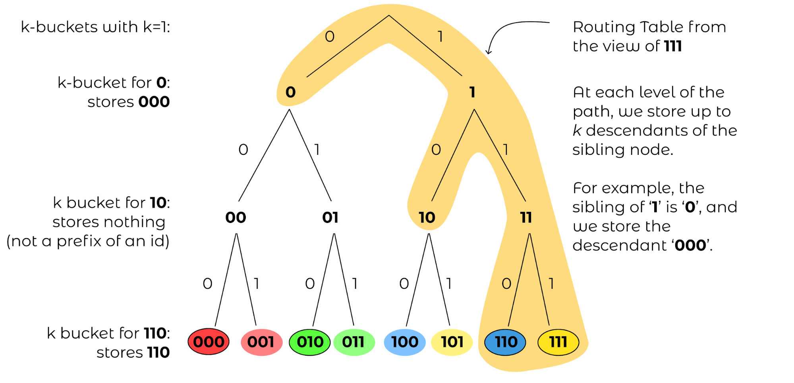
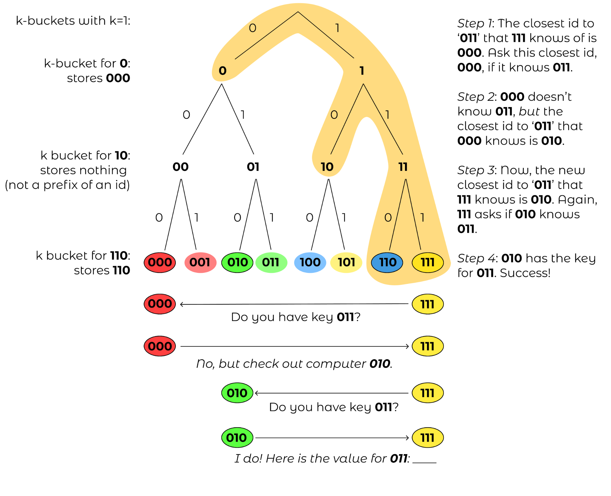
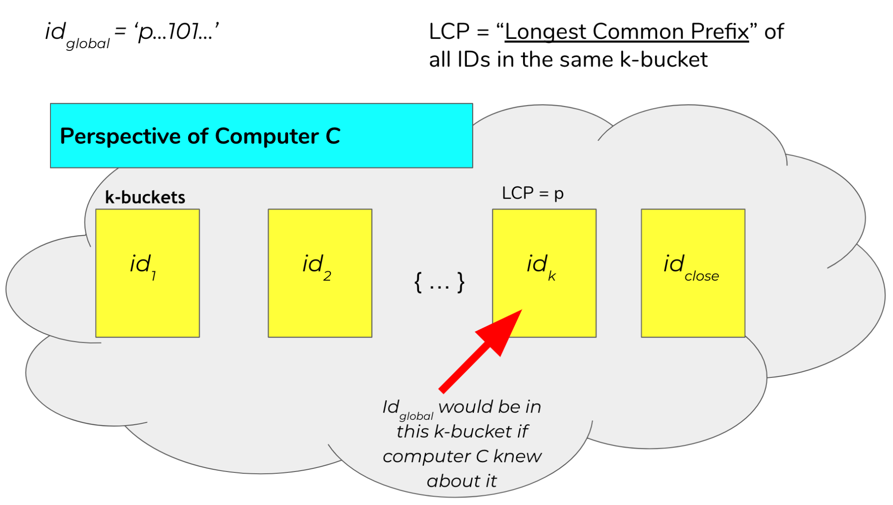
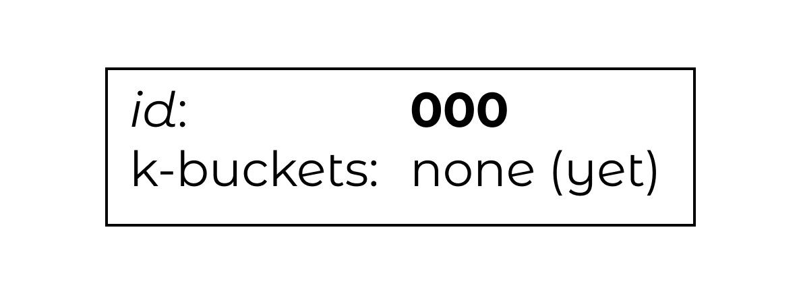
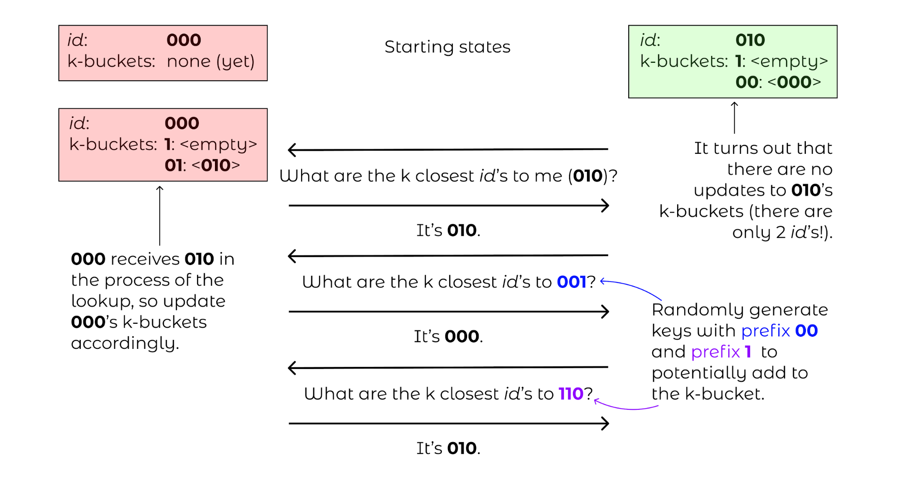
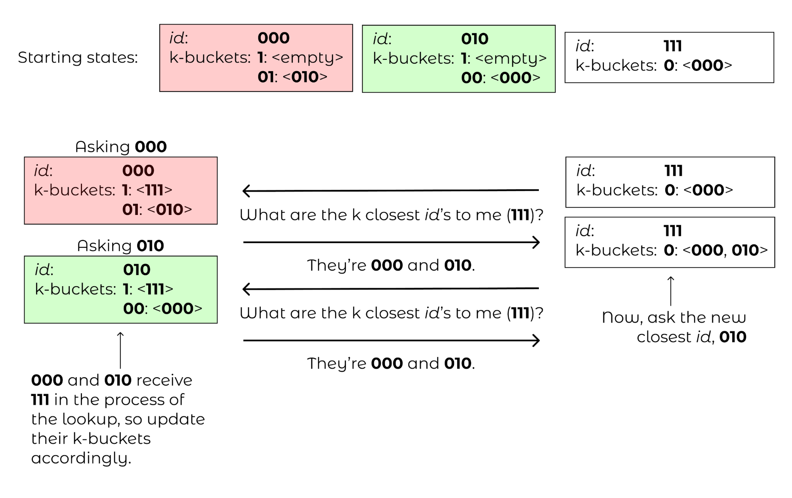

*************************************
Distributed Hash Tables with Kademlia
*************************************

===============================================
Motivation: A Book-Lending Thought Experiment
===============================================

Imagine we enjoy reading physical books and do not
want to read books online. How would we go about 
finding books to read?

Libraries are fantastic. They have enormous selections of books, 
and it is quite easy to find the book you are looking for in the library
with the Dewey Decimal System. At the same time, it can be fun to physically own books and 
share books between our friends.

This alternative approach to reading, while fun, has some complications.
For example, how do we determine who owns which book? Most people don't
bother maintaing a central list of who owns what. That would also be a pain
to maintain (at least pre-Google Docs). Imagine we didn't care who owned
which book and just wanted to make sure you system easy to follow and 
resistant against new and volatile friendships. How would we design
our system?

In particular, how would we:

- Determine who owns which books?
- Communicate with our friends to fetch our desired book?
- Handle the scenario when you have a falling-out with a friend and that person decides to leave the group suddenly?
- Scale to a *super* (1,000,000) large friend group while still letting this system remain functional? 

This contrived example is somewhat related to the notion of peer-to-peer file sharing.
A data structure for a peer-to-peer filesharing system is a Distributed Hash Table (DHT).

=========================================
Peer-to-Peer File Sharing in Action: IPFS
=========================================

A cool product that uses DHTs under the hood is the 
Inter-Planetary File System (IPFS). Definitely consider trying
`IPFS <https://ipfs.io>`_ out for yourself.

We will now explore how DHTs work.

=======================
Distributed Hash Tables
=======================

Suppose we want to store data in a way such that we can easily find what we are looking for. One data structure that allows that is our traditional map, where we store elements as <key, value> pairs. Maps support two operations: PUT(key, value), which inserts a new element, and GET(key), which returns the value of the element corresponding to that key. For example, if we wanted to store a bunch of words and definitions on our computer, we save (PUT) each definition (value) under the word (key) it defines. When we want to know what a word means, we get its definition by looking it up (GET) in the map.

While maps are useful, however, they do have one major limitation: they are only stored locally on a single computer. What happens if our elements have super large values, like a file that contains a 2-hour long movie? This is an issue because the more movies we store, the more space we take up in the computer, and it can become difficult to store our entire map on one computer. Alternatively, what if we have an enormous number of elements? One way to solve this problem is to store separate parts of the map on separate computers. We could connect these parts by designating a centralized computer, or coordinator, which would coordinate which keys are stored on which computer. This map would not be very resilient, however, to when the coordinator goes offline.

A Distributed Hash Table (DHT) is a kind of data structure stored on multiple computers that aims to address this issue. We still want our basic operations PUT(key, value) and GET(key), like we had in our map, but we want our data structure to still stand even if some computer leaves our network. In designing our DHT, we want it to be:

- *Scalable*. When more computers participate, we want the DHT to split up the elements evenly among the computers.
- *Fault-Tolerant*. If a computer leaves the network, we want to be able to access the elements that it previously held.

There are some fundamental limitations here. If all computers leave at once, we have nowhere to store anything -- thus, we will need to assume that computers leave at a slow enough rate. Intuitively, we will probably need to replicate keys across different computers so that key-value pairs will be recoverable even if some of those computers leave at once.

==================================================
A Decentralized But Organized Partition of the Map
==================================================

Our goal will be to design a protocol that divides up portions of the map somewhat evenly among participating computers without having a centralized coordinator. As usual, randomness can come to the rescue. We can have participating computers take on an identifier and then have elements be assigned to the computer whose id is closest to the key. These identifiers (ids) and keys can be part of some shared key space of integers, for example all 160-bit integers. This idea has several advantages: 

1. The actual choice of determining an identifier does not require any centralized coordinator.
2. Depending on the notion of closeness and space, a uniformly random selection of identifiers will likely distribute keys somewhat evenly among computers.
3. Adding a new computer requires merely shifting the few keys that were previously close to another identifier but are now closest to our new computer.

One may be queasy that our keys are limited to 160-bit integers. Don’t worry: any key can be hashed into this 160-bit keyspace with a collision resistant hash function. For historical reasons, the original authors used SHA-1.

PUT and GET operations then become simple: find the closest computer to a key, and either store or query for that key. Of course, we still have a major problem left to address: how do we find the closest computer to a given key?

Normal maps are often represented in two general ways: as a hash table and as a search tree. First, we will briefly explore how we could use a hash table to motivate a geometry for segmenting the map’s keyspace.

----------------------------
Hash Table Partitions: Chord
----------------------------

Since our keys are integers (which we could interpret as non-negative), we could interpret our hash table 
as an indexable array. We could then break up the array into contiguous blocks
and assign these blocks to participating computers. In a distributed view,
computers will implicitly claim contiguous blocks by choosing a random id
and then claim the closest keys to that computer where the distance between
a key :math:`k` and a computer with :math:`id` is simply :math:`k - id`
(where the binary representation is interpreted as a non-negative integer). 

These participating computers could be viewed as forming a ring structure 
in increasing order going in a clockwise direction. Keys assigned to a given
computer will then be those that are in the space between a computer id and
the id of the computer after it. This geometry is also called 
Consistent Hashing, and is the base layer for how Chord, a DHT, 
works (Figure 1).

    Figure 1: Illustrated here is the geometry of ring consistent hashing. 
    Displayed are four computers. Namely, we have Computer 00000, Computer 00101, 
    Computer 01001, and Computer 01101. That is, computers 0, 5, 9, and 13, 
    respectively. These numbers are randomly assigned. We can see by the color code
    that computer 5 contains all IDs between 5 and the value of the next computer (9).
    This pattern continues around the ring.

This fulfills the advantages mentioned above by making the ring become denser 
and denser as more and more computers participate. Similarly, the key spaces between 
computer ids will likely shrink and become relatively uniform as more computers insert
themselves into the network with random identifiers. Let :math:`successor(k)`
return the computer with the closest id in the clockwise direction in the ring
at point :math:`k`. A computer with :math:`id` can then store the addresses 
of computers of the form :math:`successor((id+2^i) % 2^160)` for different powers of
two up to :math:`n`, where :math:`n` is the number of computers in the ring (Figure 2).

    Figure 2: Depicted above is the same set of computers and IDs as in Figure 1. 
    However, now we are showing the computers visible from ID 0. That is, we start 
    at 0 and add successive powers of 2 up to the number of nodes in the ring. In 
    our case specifically, we have 20 computers. This means we will add the numbers
    1, 2, 4, 8, and 16 to our start node (0), and we will call successor(k) on each 
    of these nodes. Our result is a list of computers visible from node ID 0.

Lookups can consist of nodes recursively calling on the node that they know
of that is closest to the key of interest. Node lookup runtime takes :math:`O(log(n))`,
but we will not focus on analyzing the runtime, correctness, nor details of this 
structure for this article. However, if your intuition tells you that DHTs can be 
represented as segmented hash tables, then you are right!

--------------------------------
Search Tree Partitions: Kademlia
--------------------------------

Our main focus will be in examining how to partition a binary trie. 
As with most things, it is best to discover how to segment the tree with a 
visual example.

    Figure 3: A binary tree with height 3. The circled leaves represent ids of 
    computers.

Let us say that all ids and keys are in a keyspace of :math:`[0,1, … 2^3 - 1]` and are 
represented in binary. We can represent this space as a complete binary tree where 
each leaf node is a key. Circled leaves are ids that correspond to a participating 
computer in the network. In the example above (Figure 3), three computers are 
participating in the protocol with ids of 000, 110, and 111 respectively.

For Chord, e partitioned keys into contiguous blocks of a circular array/ring.
How should we partition the leaves of this tree among the circled leaves? 
A natural segmentation could be to assign a key to the node with the lowest common 
ancestor. We can then color code the diagram as follows, where leaves with the same 
color as a computer leaf mean that keys should be stored on that computer:

    Figure 4: Leaves are color coded to show that the left 4 bits have a lowest 
    common ancestor with 000 and thus are assigned to that computer. Similarly, 
    100 and 101 are assigned to the computer with id 110, and 111 has nothing assigned. This is actually erroneous,
    but it will motivate an “improvement” of closeness later.

Note that we also annotated the edges of the trie. This shows the isometry between the path from the 
root of the tree to a leaf and the binary representation of the leaf node. Common ancestors then become
common prefixes of all leaf descendants!

Note the coloration of 100 and 101. Unfortunately, there was a tie among computer nodes for the lowest common ancestor:
110 and 111 both have a common ancestor representing a common prefix of '1\_\_'. Thus, it was a somewhat arbitrary choice
to assign those keys to the computer 110.

How could we better formalize a rule for breaking this tie? In fact, a more optimal solution would be to evenly divide 100
and 101 amongst 110 and 111. Why not generalize the notion of longest common prefix?

If two computers tie for the longest common prefix, we can instead look at the most significant bit index :math:`b` where
they differ. We can then check bit :math:`b` of the key and assign the key to the computer whose bit :math:`b` in their id
equals bit :math:`b` of the key.

Notationally let :math:`100_i` be the ith bit of 100, 0-indexed from left to right. For example, :math:`100_0` = 1. Next,
consider key 100 and computer ids 110 and 111. Both 100, 110, and 111 share a common prefix of 1. However, bit 1 of 
110 and 111 are equal: :math:`110_1`=:math:`111_1`. Thus, we consider the first bit at which they differ: bit 2.
Since :math:`110_2`=:math:`100_2` but :math:`111_2 \neq 100_2`, 100 should be assigned to the computer whose id is 110.

    Figure 5: Here is the same tree, but with the correct assignments of **100** to **110** and **101** to **111**.

===========================================
Defining Distance for Keys in a Binary Trie
===========================================
We have now a mechanical definition for determining where a key should be assigned:

**Mechanical Definition of Closeness Between Keys and Computer IDs:**

Look at the binary representation of the key and computer ids. Now, start with a candidate set of all the computers’ IDs. 
While the candidate set has more than one computer id remaining, go bit index by bit index from the most significant bit 
to the least significant bit. If at least one candidate id has the same bit as the key at our current bit index, remove all 
candidate ids that differ from the key at that bit index. Once we have one ID left, that computer ID is the closest ID.

We could extend this and compare “closeness” by seeing how many iterations a computer id will remain in the candidate set 
before it is trimmed out on a certain bit index. Alternatively, we could determine the ith closest computer by removing 
the first :math:`i-1` closest computers from our candidate set and then find the closest computer out of the remaining ids. 
While interesting and complete, we would like to translate this *mechanical* definition into an *operational* definition.

Intuitively, we want to define closeness as some scalar value that strictly prioritizes similarity 
among the most significant bits over less significant bits but still allows for comparison even if
all computer ids differ from the key at hand on significant bits. In other words, we would like to
be able to add penalties to ids that differ from the key at a significant bit so that they are not
as close to ids that equal the key at that same significant bit index. We would like to add 
decreasing degrees of penalties such that ids that were penalized are permanently excluded 
from ids that were penalized later: we want to mimic this strictly shrinking candidate 
set from our mechanical description.

In this sense, “penalties” suggest that defining distance may be more intuitive than defining
closeness. One could consider a key and a computer id and look bit by bit. If the bits are the
same, no penalty should be applied. If bits differ, this earlier penalty should be applied so
that all other later penalties would still be less than this penalty. Powers of two capture this
idea of penalties perfectly: since :math:`2^i > \sum^{i-1}_{j=0}2^j`, one could add a higher power
of two for more significant bits if they differ from the key.

**Mechanical Definition of Distance Between a Key and Computer ID**: Initialize the distance value at
0. Compare the key and computer ID bit by bit. If the key and computer ID differ at the ith least 
significant bit (with the least significant bit having an index i=0), add a penalty of :math:`2^i` to the distance 
value.

One may recognize this process: this is exactly what the XOR operation does! We just need to interpret the XOR
result as a non-negative integer to allow for this bucketing of penalties to strictly order ids that have higher
bits in common under ids that differ from ids that do not have that significant bit ancestor in common.

**Operational Definition of Distance Between Keys and Computer IDs**: The distance between a key and a computer id
is the XOR of their values interpreted as an integer.

Thus, a key should be stored on the computer that is closest to the key, or has the lowest XOR value with the key 
relative to all other computer ids.

**From this point forward, distance will be defined as the XOR between two ids/keys interpreted as a non-negative integer, and the “closest” computer to a key is the computer with lowest XOR distance between its id and the key.**

Further, XOR is a distance metric. If someone is interested, please email someone at Code the Change, and we can include an appendix
proving that XOR is a distance metric.

=================================
Tree Partitions as Routing Tables
=================================
Now that we have established which keys should be stored with which computers, we need to determine how 
computers can find keys from other computers. Intuitively, we would like to only store the addresses of 
a small amount of computers but still be able to find keys relatively quickly. One possible goal is that
every query for a computer should get us at least “one bit closer” to the computer that actually contains
the key of interest. This could roughly give us a runtime of :math:`O(log(n))`. Let’s assume that our participating
computers all exist at the beginning and never leave, so they can be represented by the tree shown above.

We could therefore store a logarithmic number of computer ids and their corresponding IP addresses in an 
organized contact book. Which computer ids should we store? We could look back at our complete tree diagram 
for inspiration.

    Figure 6: The routing table from the view of computer with id **111**, with the corresponding :math:`k`-buckets for k=1.

For now, let’s ignore *how* a computer develops its address book and instead think about *what* we want the address book 
to look like. Let’s consider the view of computer 111. Note that we could just have computer 111’s “view” of the map be
solely the encircled region above. In these sibling nodes, we could merely store any computer whose id is a descendant
of that sibling node. For example, for the node that represents prefix ‘0’, we could store ‘000’. There are no computers
that begin with prefix ‘10’, so that internal node will be empty.  For the node that represents prefix ‘110,’ we could 
store the address of computer ‘110.’ Each of these sibling nodes is called a “:math:`k`-bucket” for reasons mentioned later 
(for now, k=1).

====================
Key/Computer Lookups
====================

Let’s now consider the farthest away key: 011. How would a **GET(011)** work for computer 110? This key would be stored
in computer 010. However, ‘010’ is not listed in our node 111’s address book. The closest computer to 010 that we know 
of is computer 000. We could then ask computer 000 to tell us whether it has key 011 or if computer 000 knows of any 
closer computers to 011. Computer 000 should in turn have 010 in its address book, so 000 could return the IP address 
of 010 to 111, and then 111 could ask 010 for key 011, which it should have.

    Figure 7: 111 wants to perform GET(011). 

We can formalize this process as follows:

1. Find the closest computer in your routing table (via XOR).
2. While the closest computer you know of does not have the key and has not already responded:
    a. Ask the closest computer for the key or a closer computer
    b. If the closest computer responds with a closer computer, update our closest computer.

Now, let’s analyze the correctness assuming that each computer routing table is correctly 
populated with at least one computer id per :math:`k`-bucket if such a computer exists within
that range for that :math:`k`-bucket. Let :math:`id_{global}` be the identifier of the closest computer to the key by XOR.

Note that each time a computer :math:`c` returns a closer computer :math:`id_{close}` to the key, this closer computer 
should be in the same :math:`k`-bucket as :math:`id_{global}`s from the perspective of :math:`c`. Why? Consider :math:`id_{global}`’s 
:math:`k`-bucket in :math:`c` and let :math:`id_k` be the computer id stored in that :math:`k`-bucket. Let :math:`p` be the binary 
prefix represented by the internal node for :math:`id_{global}`’s :math:`k`-bucket.

If :math:`id_{close}` is in a different :math:`k`-bucket than :math:`id_{global}`, then :math:`id_{close}` has a different prefix than 
:math:`p` for those first :math:`|p|` bits. Given that more significant bits always contribute more to distance than all the 
successive bits combined, and that :math:`id_{close}` is closer than :math:`id_k`, then no identifier with prefix :math:`p` can be 
closer than :math:`id_{close}` to the key. But :math:`id_{global}` has prefix :math:`p` and is the closest identifier globally to the key, 
so this cannot be true. Thus, the closest computer cannot be inserted into any :math:`k`-bucket other than the same :math:`k`-bucket as 
:math:`id_{global}`. For a visual understanding of what we are trying to prove, see figure 8 for a description of this proof by contradiction: 
we are trying to show that that :math:`id_k=id_{close}`.

    Figure 8: The figure above illustrates the routing table of computer :math:`c`. Each of these :math:`k`-buckets 
    contains an ID with a certain longest common prefix. For example, the :math:`k`-bucket on the far left contains :math:`id_1`
    and represents all ids that differ from :math:`c`’s id on the first bit. Note that because :maht:`id_{close}` 
    is in a different bucket as :math:`id_k`, this would imply that :math:`id_{close}` is closer to our goal than 
    :math:`id_global`, which is a contradiction.

This invariant over each lookup will guarantee that we will eventually find :math:`id_{global}` by having us increase our 
common prefix with :math:`id_{global}` in each lookup iteration. Since there are only :math:`log(n)` unique bits in :math:`id_{global}`,
our lookup runtime and number of hops should take expected time :math:`O(log(n))`.

We could visualize these network requests as “traveling down the trie.” Since we are guaranteed to always return 
identifiers that are in the same :math:`k`-bucket as where :math:`id_{global}` would be, we are guaranteed that each iteration of 
our closest known id will have a common prefix with :math:`id_{global}` that is at least 1 bit larger than the previous id.
This will guarantee that if the key space is 160 bits, then we will find :math:`id_{global}` in 160 iterations. If the tree is 
sufficiently balanced enough, which will be with high probability given that computers generate their ids uniformly at 
random, we should instead find :math:`id_{global}` in :math:`O(log(n))` iterations, where :math:`n` is the number of computers 
participating in the network. 

We have found a way to do lookups given a static network! Woohoo! Note that since the key space equals the computer-id space, 
looking up computers and looking up keys are equivalent procedures: instead, we look for the closest computer to a given computer id.

Finally, we can simplify this highly unbalanced routing table trie somewhat. We will never have computers in the :math:`k`-bucket 
corresponding to the same 158-bit prefix. Thus, why should we store those :math:`k`-buckets at all? Instead, a computer should consider the 
:math:`k`-buckets up to and including the computer ids that are closest to it that it knows of.

===================================
Supporting Dynamic Leaves and Joins
===================================
The gap from our current state to a fully dynamic DHT is not as far away as it seems. Let us first consider how we can extend 
this protocol to support computers sporadically leaving. Let us assume that we have some known parameter :math:`k` that represents the 
number of computers such that it is extremely unlikely that all of those computers will leave the network in the same hour. 
For example, the authors of the original Kademlia paper experimentally determined that their :math:`k` should be 20.

Next, our :math:`k`-bucket should, instead of storing just 1 computer, actually store k computers within that :math:`k`-bucket’s range. 
Thus, with high likelihood, there will always be at least one computer online in each of a computer’s :math:`k`-buckets.

How do computer lookups change? Our new procedure is as follows:

1. Find the k closest computers in your routing table (via XOR).
2. While you have not heard responses from all the k closest computers:
    a. Ask the new k closest computers for their own k closest computers in their respective routing tables, potentially including themselves.
    b. Update our list of the k closest computers we know of given the newly returned closer computers.

Next, how do we keep our :math:`k`-buckets up to date? If a computer :math:`c` in a :math:`k`-bucket has not been queried over the past hour, 
our current computer current should ping :math:`c` to make sure it is still online. If :math:`c` does not respond, it can be evicted 
from the :math:`k`-bucket table. Therefore, computers can leave the network at any point during the protocol without notifying other
computers: this computer will just be cleaned out of a computer’s :math:`k`-buckets.

If we learn of new computer ids and their IP addresses by doing lookups and a :math:`k`-bucket has additional space, we can insert 
this (id, IP addr) pair into the :math:`k`-bucket. Note that this eviction/insertion paradigm favors older computers in a :math:`k`-bucket. 
This decision is intentional: while this means that computers that have stayed longer in the network get an unfair burden of network 
traffic, the authors experimentally found that computers that have been around the longest in the network are much more likely to 
continue staying on than new computers. Thus, old computers are favored to maximize connectivity in the network from experimental 
observations of how peer-to-peer network participants behave.

Next, how do we become aware of new computers that could fit into what are unfilled :math:`k`-buckets? We could perform lookups on random 
ids within a :math:`k`-bucket’s id range (the range is defined by all leaves that are direct descendants of the 
:math:`k`-bucket’s corresponding internal node in the complete tree) and thus learn about computers within that :math:`k`-bucket if 
they exist. This is called a bucket refresh.

Finally, we support computer joins. A computer :math:`j` must know the :math:`id` and IP address of at least one other computer :math:`c`. 
:math:`j` will then perform a computer lookup on itself to get the closest known computers to :math:`j`. Then, :math:`j` will perform 
bucket refreshes for all :math:`k`-buckets from the closest known computers to :math:`j`.  This will populate the routing table of 
computer :math:`j` based on the correctness of the lookup algorithm and the fact that the routing tables of other computers are 
sufficiently populated. In addition, all computers that are being queried by :math:`j` will become aware of :math:`j` in the process 
and thus will have the opportunity to insert :math:`j` into their own :math:`k`-buckets if their corresponding bucket is not already full.

Finally, whenever a computer *current* learns of a new computer :math:`c`, current can also check if :math:`c` is closer to any keys 
currently stored on current are actually closer to :math:`c`. If that is the case, it can issue PUT requests to :math:`c`for those keys. 
fThis will allow keys to be automatically moved to new but closer computers.

=========================================
Walkthrough of a Kademlia Network Genesis
=========================================

Every Kademlia network comes from modest beginnings. Consider the computer 000, which will store its own keys at the beginning. 
For simplicity, we will consider the case where :math:`k=2` on our familiar 3-bit keyspace.

    Figure 9: A single computer with id 000.

Next, a new computer 010 joins, performing a computer lookup of itself on 000. Computer 000 will only respond with nothing, 
so both computers will end their routing table with just each other. Since there is only a :math:`k`-bucket of the form between 
00 and the root, 010 will only perform bucket refreshes within 1\__ and 0\__.

    Figure 10: Routing tables for **000** and **010**, with **010** asking **000** for 
    1) the closest ids to itself (**010**), 2) the closest ids to some random id with prefix **00** and
    3) closest ids to some random id with prefix **1**. 

Finally, consider computer 111 joining while only knowing computer 000. 111 will issue a computer lookup 
on itself. It will start by asking “what are the closest computers to myself” for 000, receiving 010 in
the process. The closest node 111 knows to itself is 010, so 111 will only have a :math:`k`-bucket for 
prefix **0** which will contain 000, 010. 111 will then ask “what are the closest computers to myself” 
to 010, receiving 010 and 000 again in the process, so 111 will terminate its lookup procedure. 010 and 000, 
after hearing requests from 111, will populate 111 in their prefix **1** :math:`k`-buckets. 

    
    Figure 11: The lookup process when 111 is added to the network.

========================
Piecing Together the DHT
========================

With key and computer lookups down, all that remains is to more formally define the network remote procedure calls (RPCs). 

A computer can be asked **FIND_COMP(id)** call and will return :math:`k `of the closest computer ids in its routing table 
and their IP addresses.

A computer can receive a **FIND_VALUE(key)** call and will return the value if the (key,value) pair is stored
locally on the machine. If the key is not stored locally, the computer will respond as if it received a **FIND_COMP(key)** call.

A computer can receive a **STORE(key, value)** and will just store the key-value pair in a local map of its choice.

A computer can receive a **PING** call to verify that the computer is still online.

To ensure that keys remain in the network, the caller who stored or requested a resource is required to re-issue a **STORE** call 
within a given time frame, such as every 24 hours. Otherwise, computers will automatically evict old key-value pairs to reduce bloat.

To speed up computer lookups, **FIND_COMP/FIND_VALUE** calls can be done asynchronously for some asynchronous parameter :math:`\alpha`. 
In the original paper, :math:`\alpha=3`. In other words, we could issue **FIND_COMP** calls in parallel to 3 different computers at a 
time during our computer lookup procedure.

==========
Conclusion
==========

At last, we have our DHT! A **GET(key)** operation is a computer lookup at key followed by a **FIND_VALUE()** call for the :math:`k` closest 
computers to key by id. A **PUT(key, value)** operation is a computer lookup at :math:`key` followed by a **STORE(key)** operation at the 
:math:`k` closest computers (which should be repeated within some interval if you want the (key,value) pair to stay there).

The original paper mentioned various improvements to the DHT. For example, to reduce traffic for often-accessed keys, one could store the 
keys on a wider group of closer computers each time it is accessed. To increase computer discovery for a newly inserted low-depth computer 
id (in the case of unbalanced trees), the authors recommended storing subtree of :math:`k`-buckets instead of a single :math:`k`-bucket 
in the routing table to increase network discovery of this newly inserted computer id that now commands a large region of the key space.

Note that we made a key assumption: the computers would choose their ids at random and follow the protocol honestly. 
Often, distributed systems such as Kademlia operate in a wild, trustless environment. S/Kademlia extends Kademlia to prevent various sybil 
attacks with cryptographic hash function hardness as a form of proof-of-work.

==============
More Resources
==============

Of course, it would be super valuable to read the `original paper introducing Kademlia <https://www.ic.unicamp.br/~bit/ensino/mo809_1s13/papers/P2P/Kademlia-%20A%20Peer-to-Peer%20Information%20System%20Based%20on%20the%20XOR%20Metric%20.pdf>`_.

In addition, Kelsey Chan's `interactive visualization for various Kademlia operations <https://kelseyc18.github.io/kademlia_vis/basics/1/>`_ is both quite visually appealing and helpful for understanding how Kademlia works.

=========================
Licensing and Attribution
=========================

Copyright (c) Drew Gregory (https://github.com/DrewGregory) <djgregny@gmail.com>, Jose Francisco, Ben Heller, and Zarah Tesfai. This article was adapted from a `CS 166 project <http://cs166.stanford.edu/>`_.

|CC-0 license|

.. |CC-0 license| image:: https://i.creativecommons.org/l/by/4.0/88x31.png
   :target: http://creativecommons.org/licenses/by/4.0/

This work, including both this document and the source code in the associated
GitHub repository, is licensed under a `Creative Commons Attribution 4.0
International License <https://creativecommons.org/licenses/by/4.0/>`_.

This work was initially created for a workshop at
`Stanford Code the Change <http://www.codethechange.stanford.edu>`_.

