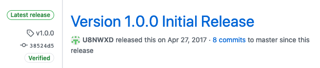

**********************************************
Securing the Open Source Software Supply Chain
**********************************************

============
Introduction
============

----------
Motivation
----------

Case Study: SolarWinds
**********************

Sometime before March 2020, Russia's Foreign Intelligence Service (SVR)
compromised SolarWinds, a software company based in Texas that makes the
Orion network management tool. Note that Russia has denied involvement,
but US officials have said the attack has the hallmarks of an SVR
operation.

The SVR used its access to add malicious code (the payload) to Orion.
Orion is used by thousands of organizations all over the world,
and nearly eighteen thousand of them installed a compromised version of
Orion. Among these eighteen thousand were US Pentagon, Treasury,
Department of Homeland Security, and National Institutes of Health, not
to mention other governments and companies.

While we won't know the full impact of this hack for years, this hack
highlights how vulnerable the software supply chains we all rely on are.

To read more about the SolarWinds hack and see the articles from which I
drew the information about the hack in this guide, see `this blog post
from Yubico
<https://www.yubico.com/blog/lessons-from-the-solarwinds-incident/>`_,
`this essay from Bruce Schneier
<https://www.schneier.com/blog/archives/2020/12/russias-solarwinds-attack.html>`_,
and `this NPR story
<https://www.npr.org/2020/12/15/946776718/u-s-scrambles-to-understand-major-computer-hack-but-says-little?t=1609203739000>`_.

Other Supply-Chain Hacks
************************

While the SolarWinds hack is among the most recent and damaging
supply-chain attack, there have been many others. Here are some from the
Linux Foundation's `"Open Source Software Supply Chain Security"
<https://www.linuxfoundation.org/wp-content/uploads/oss_supply_chain_security.pdf>`_
publication from February 2020:

* In 2015, developers were tricked into using a malicious version of
  Xcode that inserted malware into their apps.
* In 2017, attackers introduced malicious libraries to the Python
  Package Index (PyPI). They chose library names that were similar to
  legitimate, popular packages so developers would install them by
  accident.
* In 2019, attackers compromised the Ruby account of the developer of
  the popular Ruby package ``strong_password``. The attackers used this
  access to deploy a new version of the package that would download and
  execute arbitrary code of the attacker's choice on the developer's
  machine.
* Later in 2019, 11 backdoored Ruby packages were found to have been
  infected with malicious code. Four were infected by compromising a
  developer's account.

Responsibility of Software Developers
*************************************

When users run our software, they are trusting us to ensure it is free
of malicious code. In this guide, we'll discuss how software projects
get compromised and what you can do to keep your projects safe.

============================
How Projects Get Compromised
============================

At a high level, you can think of your project as a mixture of code from
you and your dependencies:

.. code-block:: plain

    Dependency -----> +--------------+
    Dependency -----> | Your Project | -----> Users
    Dependency -----> +--------------+
                             ^
                             |
                             |
                      Code You Write

From this view, we see that your project can be compromised in a few
ways:

* Vulnerable dependencies
* Intentionally-introduced malicious code from you
* Accidentally-introduced security bugs from you

Let's take a look at each of these and how you can mitigate the risks
they pose.

-----------------------
Vulnerable Dependencies
-----------------------

According to GitHub's `Octoverse 2020 Security Report
<https://octoverse.github.com/static/github-octoverse-2020-security-report.pdf>`_,
an active repository in a supported package ecosystem like PyPI or NPM
had a 59% chance of getting a Dependabot alert about a dependency with a
security vulnerability in 2020. This means your repository will probaby
have a dependency with a security vulnerability.

Luckily for us, GitHub will automatically send us `Dependabot
<https://docs.github.com/en/free-pro-team@latest/github/managing-security-vulnerabilities/about-alerts-for-vulnerable-dependencies>`_
alerts whenever a dependency has patched a vulnerability. By staying on
top of these alerts, you can keep your dependencies up-to-date.

.. important:: Act on Dependabot alerts quickly to upgrade vulnerable
   dependencies.

-----------------------------------
Intentional Malicious Code from You
-----------------------------------

You might first think about one of your developers intentionally
introducing security bugs. In my opinion, this is pretty unlikely in the
small teams we work on. What small risk remains is pretty effectively
mitigated by the fact that ``git`` lets us track who introduced what
changes.

A bigger threat is an attacker compromising one of your developers'
accounts. Recall that many of supply-chain attacks we discussed
earlier involved compromising a developer's account. Here are some steps
you as developers can take to secure your accounts:

* Use a strong, unique password for your GitHub account. I *highly*
  recommend using a password manager, for example `KeePassXC
  <https://keepassxc.org/download/>`_ or `Bitwarden
  <https://bitwarden.com>`_.
* Enable two-factor authentication on your GitHub account. `Here are
  instructions
  <https://docs.github.com/en/free-pro-team@latest/github/authenticating-to-github/configuring-two-factor-authentication>`_.
  This is one of the easiest and most impactful steps you can take to
  improve your personal security. Do it right now!

As a bonus step, I strongly support cryptographically signing your git
commits. GitHub has `instructions
<https://docs.github.com/en/free-pro-team@latest/github/authenticating-to-github/signing-commits>`_
you can follow. For example, if you look at our `guides repository
<https://github.com/codethechange/guides/commits/master>`_ at Code the
Change, you'll see a ``Verified`` label next to our commits:

.. image:: _static/securing_oss/guides_commits.png
   :alt: A screenshot of github.com showing a "Verified" label next to
       each commit in the Code the Change guides repository.

This label indicates that our commits have each been signed by the
author with a secret key they alone control. This makes it easy to
identify commits introduced by a hacker--they will be unsigned.

.. important:: Secure your GitHub account with strong, unique passwords
   and two-factor authentication. As a bonus steps, start signing your
   commits.

----------------------------------
Accidental Malicious Code from You
----------------------------------

According to the 2020 Octoverse Security Report, only 17% of security
vulnerabilities on GitHub were intentionally malicious, and these
vulnerabilities caused just 0.2% of Dependabot alerts. Most software
vulnerabilities are just mistakes.

.. note:: Most security vulnerabilites are mistakes. Unfortunately, they
   also go unnoticed for 4 years on average.

Unfortunately, there are no easy solutions to avoiding security bugs.
GitHub has `code scanning features
<https://github.blog/2020-09-30-code-scanning-is-now-available/>`_ that
may be useful, though I haven't used them yet.

More generally, we stop security bugs the same ways we stop other bugs:
defensive coding, thorough testing, and code review. You can ensure
these steps aren't bypassed by setting up `protected branches on GitHub
<https://docs.github.com/en/free-pro-team@latest/github/administering-a-repository/about-protected-branches>`_.

.. important:: Enforce code review and passing automated tests for all
   code changes. Make sure your tests are comprehensive.

=======================
Helping Users Trust You
=======================

Just keeping vulnerabilities out of your code isn't enough. You also
have to help users trust that the code they download is secure.

----------------
Signing Software
----------------

All software you ship should be digitally signed so your users can
verify that it hasn't been tampered with. I find it easiest to create a
`signed git tag
<https://git-scm.com/book/en/v2/Git-Tools-Signing-Your-Work>`_ for each
release. If you then create a release on GitHub, you'll get a
``Verified`` label just like with commits. Here's an example from `one
of my projects
<https://github.com/U8NWXD/DicePassCLI/releases/tag/v1.0.0>`_:

       label.

.. important:: Securely sign all software releases to verify their
   authenticity.

---------------------
Version Documentation
---------------------

If your repository is ever compromised, you want to be able to tell your
users something like

    "version 1.1.2 was compromised, so please make sure you have upgraded
    to version 1.1.3."

This is only possible if you
release numbered versions of your software. I recommend following the
`Semantic Versioning <https://semver.org/>`_ numbering system, as it has
become standard in open source software.

To get the most out of versions, you should also document the changes in
each version using a changelog. In fact, the first compromise of a Ruby
package in 2019 that we discussed above was caught when a user of the
package noticed that a new version had been released without an update
to the changelog.

------------
Transparency
------------

Finally, you need to communicate to your users all the security
practices you have in place to keep them safe. This could be in your
documentation or README file. The important thing is to let your users
know what practices you follow (e.g. signing releases) so they can spot
anomalies (e.g. an unsigned release) that might indicate a compromise.

I also recommend letting people know how they can securely report
security problems to you. Many of the hacks we discussed at the The
earlier Ruby package compromise in 2019 was caught when a user reported
the problem to the developer. This required the developer to have
published secure ways to reach them. This should all go into your
security policy, for instance a `SECURITY.md file on GitHub
<https://docs.github.com/en/free-pro-team@latest/github/managing-security-vulnerabilities/adding-a-security-policy-to-your-repository>`_.

.. important:: Be transparent about your security policies and how
   people can report vulnerabilities to you.

=========================
Licensing and Attribution
=========================

Copyright (c) 2020 `U8N WXD <https://u8nwxd.github.io>`_

|license|

.. |license| image:: https://i.creativecommons.org/l/by/4.0/88x31.png
   :target: http://creativecommons.org/licenses/by/4.0/

This work, including both this document and the source code in the
associated GitHub repository, is licensed under a `Creative Commons
Attribution 4.0 International License
<https://creativecommons.org/licenses/by/4.0/>`_.

This work was initially created for a workshop at `Stanford Code the
Change <http://www.codethechange.stanford.edu>`_.
