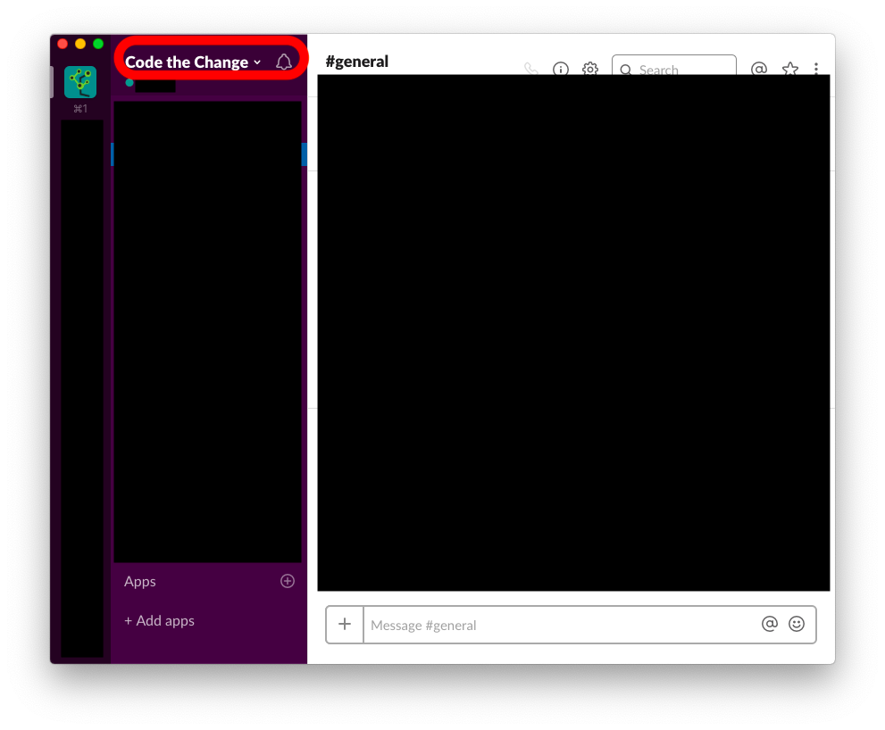
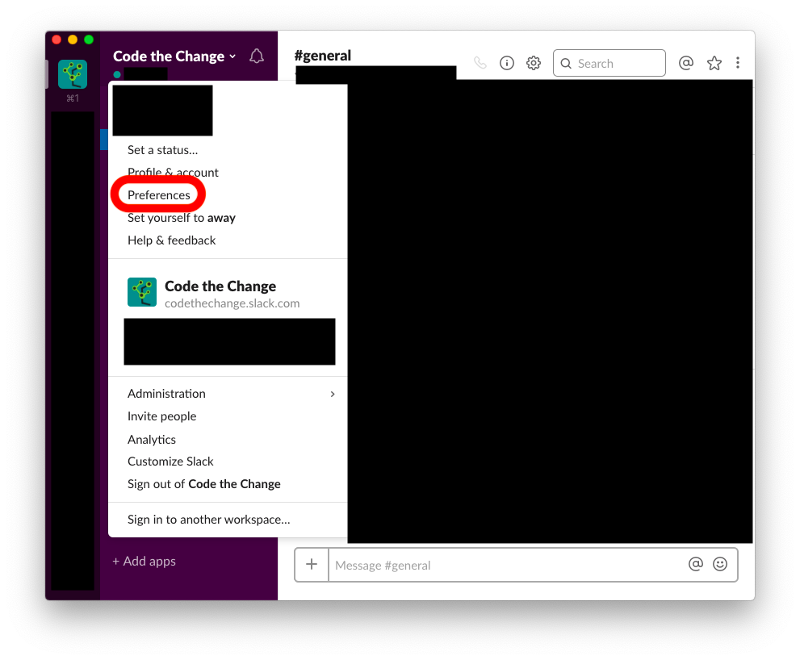
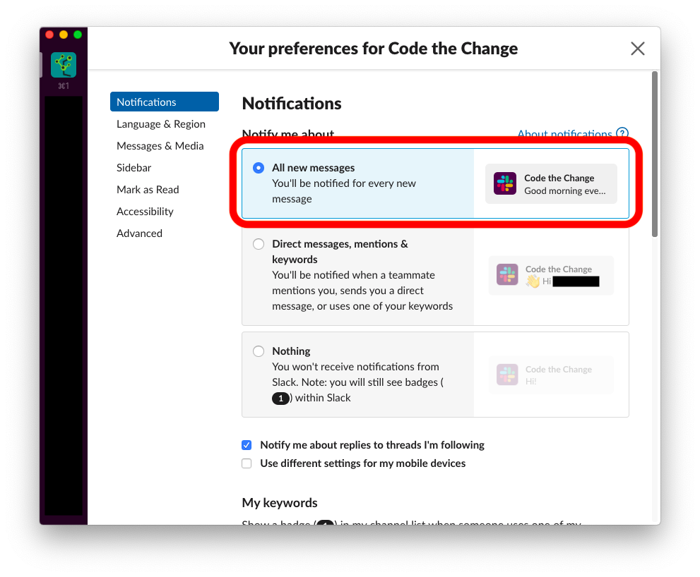
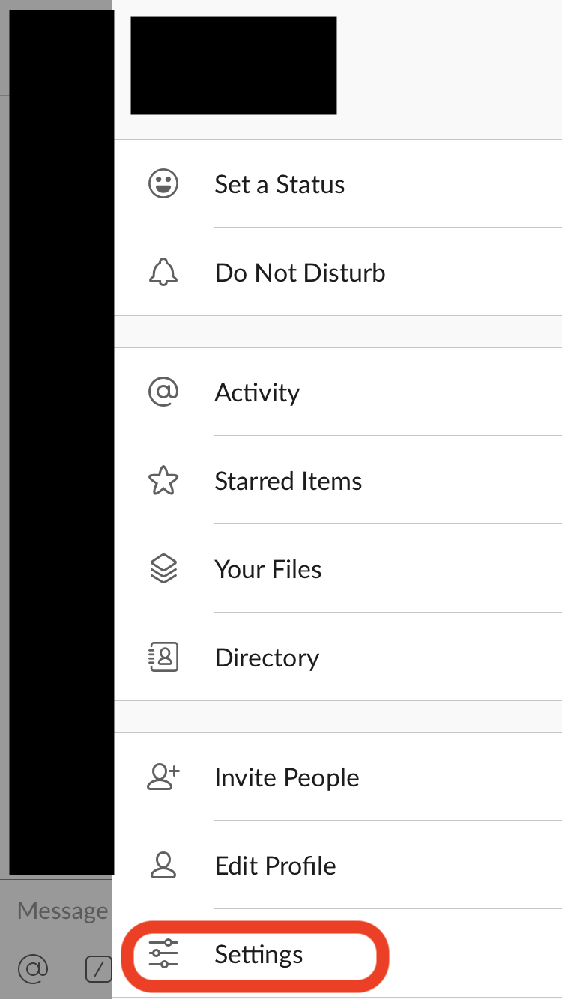
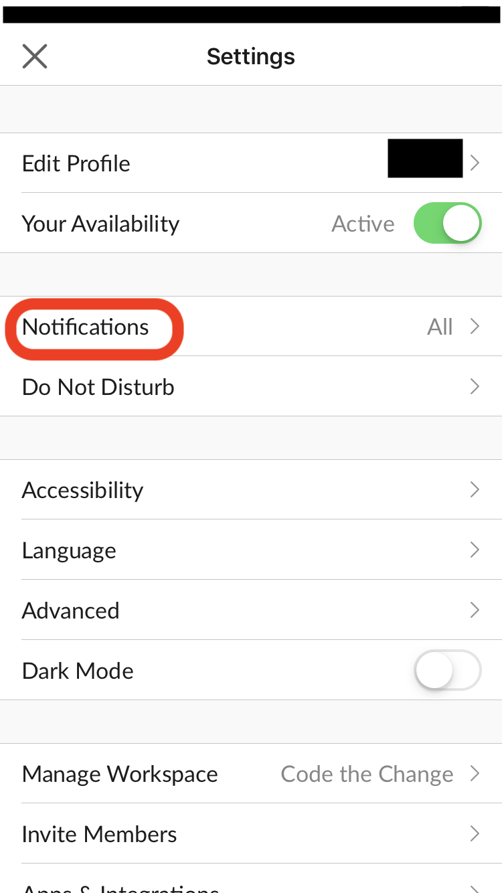
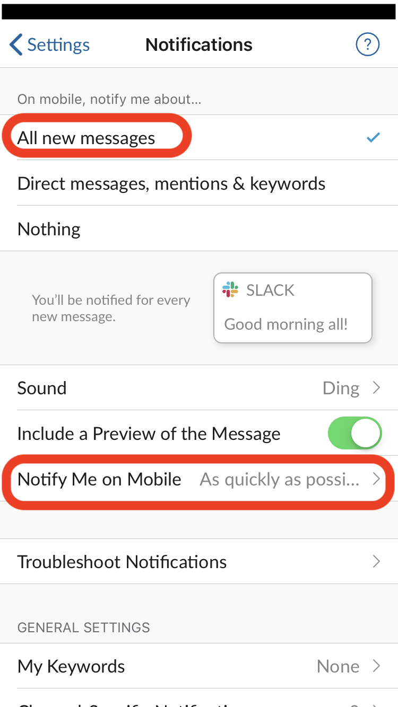

============================
Guide to Slack Notifications
============================

Slack notifications can be annoying to work with because Slack silences
many notifications by default. This guide will walk you through how to
change these settings.

-----------------------------------
Activating Notifications on Desktop
-----------------------------------

You will need to have the Slack app installed on your computer. You can
download it `here <https://slack.com/get>`_.

For MacOS
=========

#. Open the Code the Change workspace from the left sidebar.
#. Select the title bar at the top of the left panel. The title should
   read ``Code the Change``. The title is outlined in red in this image
   
   |desktop1|

#. In the drop-down menu that appears, select ``Preferences``, outlined
   in red here
   
   |desktop2|

#. In the preferences window that appears, under ``Notify me about``,
   choose ``All new messages``, outlined in red here

   |desktop3|

        Change workspace title outlined in red. The title reads "Code
        the Change".

        dropdown menu open and the option reading "Preferences" outlined
        in red.

        preferences open and the option to notify on "All new messages"
        outlined in red.

For Windows and Linux
=====================

The instructions are likely the same as they are for MacOS. If not, see
Slack's
`help page <https://get.slack.help/hc/en-us/articles/201355156-Guide-to-Slack-notifications>`_
on notifications.

----------------------------------
Activating Notifications on Mobile
----------------------------------

You will need to have the Slack app installed on your computer. You can
download it from your phone's app store.

For iPhones
===========

#. Open the Slack app and select the Code the Change workspace.
#. Swipe right to reveal the right sidebar.
#. Select ``Settings``, outlined in red here

   |iphone1|

#. Select ``Notifications``, outlined in red here

   |iphone2|

#. Choose to be notified for ``All new messages`` and to be notified on
   mobile ``As quickly as possible``. These options are outlined in red
   here

   |iphone3|

        open and the "Settings" option outlined in red.

        the "Notifications" option outlined in red.

        slack app with the options for "All new messages" and "Notify
        Me on Mobile" outlined in red. For "Notify Me on Mobile", the
        current selection reads "As quickly as possi..."

For Other Phones
================

The instructions are likely similar to those for iPhones. If not, see
Slack's
`help page <https://get.slack.help/hc/en-us/articles/201355156-Guide-to-Slack-notifications>`_
on notifications.

---------------
Further Reading
---------------

Much of this guide came from the Slack
`help page <https://get.slack.help/hc/en-us/articles/201355156-Guide-to-Slack-notifications>`_
on notifications. Check it out for more details!

=========================
Licensing and Attribution
=========================

Copyright (c) U8N WXD (https://github.com/U8NWXD) <cs.temporary@icloud.com>

|CC-4 license|

.. |CC-4 license| image:: https://i.creativecommons.org/l/by/4.0/88x31.png
   :target: http://creativecommons.org/licenses/by/4.0/

This work is licensed under a `Creative Commons Attribution 4.0
International License <https://creativecommons.org/licenses/by/4.0/>`_.
Note however that the screenshots of the Slack app may contain the
intellectual property of Slack.

This work was initially created for a workshop at
`Stanford Code the Change <http://codethechange.stanford.edu>`_.
