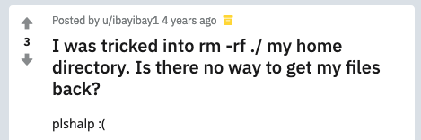

****************************************
An Introduction to the Unix Command Line
****************************************

============
Introduction
============

The original `Unix <https://www.unix.com/>`_ system was developed by
Bell Laboratores in the 1970s.  It has since become the foundation of
many operating systems, including Linux systems and macOS. Luckily for
us, while all these operating systems may have very different graphical
interfaces (GUIs), they share a common command-line interface (CLI). In
this introduction, we will cover some of the most useful tools provided
by this interface.

.. note::

    With macOS Catalina, Apple switched the default terminal shell from
    bash to zsh. This guide focusses on bash, so you may need to run
    ``bash -s`` to get a bash shell.

.. note::

    This guide is written for Mac users, but it should largely apply to
    any Unix system. I try and point out the parts that are
    Mac-specific.

----------
Motivation
----------

Once upon a time, the Unix command line was the only way to use a
develop software. Now, however, there exist a plethora of integrated
developer environments (IDEs) and graphical text editors. So why bother
learning Unix commands at all? Here are a few of my reasons.

Unix is the Language of Coders
******************************

Even if *you* don't need to know the command line, you still will have
to work with other people who live and breathe it. Take a moment to skim
`this page <https://github.com/oppia/oppia/wiki/Installing-Oppia-%28Mac-OS%29>`_
from the developer's guide for installing Oppia on a Mac. It is full of
command-line instructions! Even if you can do all your work without the
CLI, other people are going to assume you are fluent in Unix.

Knowledge Keeps you Safe
************************

Even if you didn't understand the terminal commands in the Oppia
installation instructions, you could always copy-and-paste them, right?
Don't. **Never run commands you don't understand!** Otherwise you might
end up like `this <https://www.reddit.com/r/linuxquestions/comments/312d7g/i_was_tricked_into_rm_rf_my_home_directory_is/>`_
poor soul who accidentally deleted their home folder:

|rmrf|

        into rm -rf ./ my home directory. Is there no way to get my
        files back? plshalp :("

.. warning::
    ``rm -rf <some folder>`` is dangerous! It deletes the specified
    folder and all subfolders recursively. It also does so without
    asking any questions (because of the ``-f``) regardless of files
    that are marked as not to be deleted. The deleted files are not
    moved to the trash, they are immediately deleted.

The CLI Helps Diagnose Bugs
***************************

I'm going to wax a bit philosophical for a moment, so bear with me. When
you are trying to track down a bug, you want to assume that as little
code as possible works. For example, if you have a function in a program
that is buggy, are you going to debug by running the whole program or
just the function? I'd hope you'd (barring unusual cases) choose to run
just the function so that you don't have to worry about bugs elsewhere
in your code. The same principle applies here. If you are debugging a
problem with some software, you don't want to have to assume that a full
GUI is working properly. Better to go with a command-line tool that has
been used by so many programmers, it's about as bug-free as we are
likely to get.

Sometimes graphical programs also hide important details. For example,
some programs assume that files end with a newline character. A
graphical text editor might not show a file as missing a trailing
newline, but the command line will.

Overview
========

This introduction is centered around a program I wrote. We will work
through downloading and using the program, just like you might when
installing a project you want to contribute to. Along the way, we'll use
command-line tools, and I'll explain what they do. By the end, you
should:

#. Be able to navigate, modify, and search the file system.
#. Be able to use command-line editors to work with text files.
#. Be comfortable working with text files through the terminal.
#. Understand how executables work in Unix.
#. Know how to find more information about Unix commands.
#. Have a basic understanding of how to work with command outputs.

Let's get started!

============================================
Getting Acquainted with the Unix File System
============================================

-------------
Moving Around
-------------

You are probably familiar with the files and folders of your computer
looking something like this:

|gui_filesystem|

.. |gui_filesystem| image:: ./_static/unix/gui_filesystem.png
    :scale: 100%
    :alt: A screenshot of a Mac Finder window showing some file icons
        within a folder.

In the command line, we work with the same files and folders using Unix
commands. Start by opening your terminal. On a Mac, launch the
``Terminal`` application from your applications folder. Then move to
your home folder by running:

.. code-block:: console

    $ cd ~

Note that the ``$`` here stands for the command prompt your terminal
shows when it's awaiting instructions.
The tilde (``~``) is a short-hand for your home directory, and ``cd`` is
a command that moves you to the path you give it as an argument. In this
example ``~`` is the argument. A neat trick is that running ``cd``
without any arguments is the same as providing the tilde as the
argument.

To see where you are in your file sysstem, you can print your *current
working directory* like this:

.. code-block:: console

    $ pwd
    /Users/<your_username>

Here, I've included a line without the command prompt. This is an
example of the kind of output you might see from running the command
that immediately precedes it. I will use this notation throughout this
guide, and it is commonly used for Unix systems.

Now let's explore a little. ``-`` is a short-hand that tells ``cd`` to
return to your previous working directory, and ``..`` refers to your
parent directory. ``/`` refers to the root of your file system. On a
Mac, this is usually called ``Macintosh HD``. Here's how these work:

.. code-block:: console

    $ pwd
    /Users/<your_username>
    $ cd ..
    $ pwd
    /Users
    $ cd /
    $ pwd
    /
    $ cd -
    $ pwd
    /Users

Note that these paths might be different if you're not on a Mac.
Now let's see what this journey looks like in the GUI. Open your home
folder in your computer's file explorer (e.g. Finder on a Mac). If you
right-click on the folder name in the top middle of the window, you can
see the ``Users`` folder we saw from ``pwd``. If you click it, that's
just like running ``cd ..``. If you open ``Macintosh HD``, that's like
running ``cd /``. If you click the back button, that's like running
``cd -`` (only the first time! ``cd`` doesn't save history the way the
back button does).

In the GUI, we constantly see the contents of our current directory in
the Finder window. In the CLI, we can see the same contents like this:

.. code-block:: console

    $ cd ~
    $ ls
    Desktop  Downloads  ...

The ``ls`` command lists the contents of your current directory.
We can see the equivalent GUI display by opening our current directory
in the finder:

.. code-block:: console

    $ open .

``open`` is a Mac command that opens files in the appropriate
application, and ``.`` is a short-hand for your current directory.

----------------------
Setting Up the Program
----------------------

Now let's setup the program we will work with for the rest of this
guide. Start by creating a folder somewhere on your filesystem to store
this work. You now know how to move around in the terminal, so put it
anywhere you like! Here's a useful trick: dragging a file or folder onto
the Terminal window pastes into your command line the path to that file
or folder.

.. code-block:: console

    $ cd /your/desired/path
    $ mkdir unix_guide

The ``mkdir`` command creates a folder in your current directory with
the name you specify. Now, we can download the program:

.. code-block:: console

    $ cd unix_guide
    $ git clone https://github.com/U8NWXD/unix_intro.git

This isn't a guide about ``git``, so I'm going to assume you know how it
works. If not, it's also not that important here. You can also download
the zip file from the
`GitHub page <https://github.com/U8NWXD/unix_intro>`_.

Quick sidenote here. The ``tree`` command is awesome, but it isn't
installed by default on Macs. You can install it using the also awesome
`HomeBrew <https://brew.sh>`_. If you install it, ``tree`` will show a
hierarchy of files from your current directory.

-----------------------------
Permissions and File Metadata
-----------------------------

Permissions
***********

Now that we have downloaded the code, let's run the program! Enter the
folder that git downloaded and show the files present:

.. code-block:: console

    $ cd unix_intro
    $ ls
    prog.py           secret_hash.txt   tellTaleHeart.txt zhang2019.txt

There are a number of files here we won't use until later, but let's
start with the program itself, ``prog.py``. To run a program (called an
executable) in Unix, all we have to do is type a path to it. However, to
help us prevent running executables by accident, Unix requires that we
inclue ``./`` for executables in our current working directory. Recall
that ``.`` stands for your current directory. Let's run the executable
like this:

.. code-block:: console

    $ ./prog.py
    -bash: ./prog.py: Permission denied

Oops, we get a permission error! Each Unix file has permissions that
specify who can read, edit, and execute it. To see these permissions,
run ``ls`` with the ``-l`` flag, which tells ``ls`` to show additional
information, including permissions, about each file.

.. code-block:: console

    $ ls -l
    -rw-r--r-- 1 cs  staff   4052 Jan  8 09:26 prog.py
    ...

The ``-rw-r--r--`` part specifies the file's permissions. It's made up
of four parts:

``-``
    This specifies the file type, for example whether the file is a
    directory.

``rw-``
    This indicates the permissions of the user that owns the file, which
    we can see from the output above is me (``cs``). You'll see your
    username there. The ``rw`` means we can read and write, but the
    ``-`` means we cannot execute.

``r--``
    This indicates the permissions assigned to the group that owns the
    file. They have only read permissions. In my case, the group
    ``staff`` owns the file, as you can see from the output above.

``r--``
    This indicates the permissions assigned to all other users. They can
    only read.

Unix uses octal to abbreviate these permissions. Each of the last
three groups above can be thought of as sets of three bits. In binary,
these bits are ``(110)(100)(100)``, where I have used parentheses to
separate the three sets of bits. Recall that to convert binary to octal,
we can take each group of three bits, evaluate each as a decimal number,
and then concatentate the resulting digits. In this case, this procedure
yields the octal number 644, with each digit specifying the user (who
owns the file), group (who owns the file), or world (everyone)
permissions.

With that in mind, what permissions do we want the file to have so that
we can execute it?

.. raw:: html

    

        
Click to reveal the answer.

         
        We want permissions 744. We only change the first digit to
        affect our own permissionsas the owner. We make it a 7, which in
        binary is 111, to give ourselves full permissions, including
        execution.
         
    

     

So let's make our program executable:

.. code-block:: console

    $ chmod [octal permissions number] prog.py

substituting in the permissions number you found above. Now if we view
the permissions again, you should see an extra ``x`` indicating you have
execution permissions:

.. code-block:: console

    $ ls -l
    -rwxr--r--  1 cs  staff   4052 Jan  8 09:26 prog.py

Last Modified Time
******************

Now we can run the program! First, let's use its help feature to see
what it can do:

.. code-block:: console

    $ ./prog.py -h
    usage: prog.py [-h] {edited,diff,pass,hash,secret} ...

    A program to help you experiment with some UNIX commands

    positional arguments:
      {edited,diff,pass,hash,secret}

    optional arguments:
      -h, --help            show this help message and exit

There are a bunch of features here that we'll get to later, but let's
start with the ``edited`` feature. It can tell us how long ago a file
was modified. Let's create a file using the ``touch`` command and then
see how long ago it was modified:

.. code-block:: console

    $ touch foobar
    $ ./prog.py edited foobar
    0:00:03.692538
    This program is part of unix_intro (https://github.com/U8NWXD/unix_intro)

Great! We modified our file (by creating it) about 3 seconds ago. Now
let's try some other ways of editing the file:

* Using ``touch``: ``touch foobar``.
* With a text editor: Open the vim editor with ``vim foobar``, then type
  ``i`` to enter insert mode. Make some changes (navigate with arrow
  keys), and then leave insert mode by pressing escape. Then, save and
  exit by typing ``:wq``.
* Renaming it: ``mv foobar foo`` will "move" the file ``foobar`` to the
  file ``foo``, which effectively renames it.

Shebangs
********

But how does the terminal know how to execute the program? It has the
``.py`` extension, but it could still be python 2 or 3. In fact, the
file extension is irrelevant. Instead, the terminal relies on a
*shebang*, which is a comment at the top of the file. Take a look using
``head``, which shows the first few lines of a file:

.. code-block:: console

    $ head -n 2 prog.py
    #!/usr/bin/env python
    # This file is part of unix_intro (github.com/U8NWXD/unix_intro),

See that ``#!/usr/bin/env python``? That tells the terminal to use
whatever executable is run when you type ``python`` into the terminal.

As a quick aside, ``head`` has a complementary command called ``tail``
which does the same thing, only from the end of the file.

===================
Looking Up Commands
===================

We can also see this metadata ourselves. Remember the ``ls -l`` command?
We can lookup what the rest of its output means in its manual page:

.. code-block:: console

    $ man ls

Look for the ``-l`` entry and read where the modification timestamp is
shown.

.. note::
    The ``man`` command is invaluable. If you need to figure out what a
    command does, it should be your first stop. Online documentation is
    great, but sometimes commands have slightly different syntax on
    different operating systems. The manual pages from ``man`` should
    always be accurate.

We can also see where the ``ls`` executable is on the system:

.. code-block:: console

    $ which ls
    /bin/ls

This is super helpful when you want to know which version of a command
you are running. For example, try:

.. code-block:: console

    $ which python

This will tell you which python installation you are running now. If you
haven't already discovered, there can be many python installations on a
single system!

===============
Comparing Files
===============

Let's move on to another of the program's features, ``diff``, which
checks whether two files are identical. Let's try it out by making a
copy of Edgar Allen Poe's *Tell Tale Heart*:

.. code-block:: console

    $ cp tellTaleHeart.txt copy.txt

As you may have guessed from this example, ``cp`` copies the file at the
first argument to the second argument. Now, let's see if they are the
same:

.. code-block:: console

    $ ./prog.py diff tellTaleHeart.txt copy.txt
    True
    This program is part of unix_intro (https://github.com/U8NWXD/unix_intro)

We get ``True``, indicating that the files are the same, as we'd
expect. Now go ahead and edit ``copy.txt`` in vim and try again:

.. code-block:: console

    $ ./prog.py diff tellTaleHeart.txt copy.txt
    False
    This program is part of unix_intro (https://github.com/U8NWXD/unix_intro)

Now they're different! We can find the difference using ``diff``:

.. code-block:: console

    $ diff tellTaleHeart.txt copy.txt

The output identifies the lines that are different between the two
files. If you've used ``git diff`` before, this is similar.

=====================
Environment Variables
=====================

Notice the pesky line that the program always prints out telling us it
is part of ``unix_intro``? There is a way to hide it, but instead of
using an argument, it uses another common way to configure Unix
programs: environment variables.

Environment variables are variables accessible to every program running
in your terminal. You can see all your current variables with
``printenv``:

.. code-block:: console

    $ printenv
    SHELL=/bin/bash
    PWD=<your current directory>
    LANG=en_US.UTF-8
    OLDPWD=<your previous directory>
    ...

Notice that ``OLDPWD`` shows your previous directory and ``PWD`` your
current one. This is how ``cd -`` and ``pwd`` work!

To disable that annoying line (I'll call it an epilog), we need to set
an environment variable called ``UNIX_INTRO_DISABLE_EPILOG`` to 1 (which
will mean true for Python). Set it like this:

.. code-block:: console

    $ export UNIX_INTRO_DISABLE_EPILOG=1
    $ ./prog.py diff tellTaleHeart.txt copy.txt
    False

See, no epilog!

Let's say we want to avoid typing that long variable name each time. We
can save it to a file and then load that file instead. To do this, open
a new file in vim called ``environ``:

.. code-block:: console

    $ vim environ

and write in it ``export UNIX_INTRO_DISABLE_EPILOG=1``. Now, you can set
the variable just by using the ``source`` command, which loads the
contents of a file into your terminal:

.. code-block:: console

    $ source environ

Go ahead and try it in a new terminal window!

==============================
Handling Large Command Outputs
==============================

Our program can also generate passwords by selecting random words
(obligatory `xkcd reference <https://www.xkcd.com/936/>`_). Try it out:

.. code-block:: console

    $ ./prog.py pass 3
    Cainian
    urceolate
    neighboress

Of course your words will be different (it's random!). Now let's make a
really strong password:

.. code-block:: console

    $ ./prog.py pass 100
    teetotalism
    semiprimigenous
    rhyacolite
    ...

That's a lot of output! Let's use ``less`` to make the output scrollable
and avoid cluttering up our terminal history:

.. code-block:: console

    $ ./prog.py pass 100 | less

Notice we used a fancy new operator here, the pipe (``|``) operator. It
takes the output from the left-hand command and sends it ("pipes it") to
the right-hand command. This is very useful for stringing commands
together.

We can also send our password to a file using ``>``, another cool
operator:

.. code-block:: console

    $ ./prog.py pass 100 > password.txt

Go ahead and take a look at ``password.txt`` in vim. Now let's add
another 100 words. If we use ``>`` again, we'll overwrite the file, but
if we use ``>>``, we can append to it:

.. code-block:: console

    $ ./prog.py pass 100 >> password.txt

Now that we have a lot of words, we can do some other cool things to
them. First, you need to know that the ``cat`` command prints out the
contents of a file. With that, we can sort them:

.. code-block:: console

    $ cat password.txt | sort | head

and we can remove any duplicates:

.. code-block:: console

    $ cat password.txt | sort | uniq | wc -l

.. note::

    The `uniq` command cnly compares adjacent lines, so you have to sort
    the file first!

Here I used the ``wc`` command, which counts. With ``-l``, it counts the
number of lines it is provided. Were there any duplicated words?

==============
Deleting Files
==============

.. warning::

    Be careful deleting files from the command line! There's no trash,
    so once you run the command, your files are gone.

Remember that story at the top about the poor fellow who erased their
home directory? Now we can learn what that command did. We delete files
using ``rm``. For example, delete the password file:

.. code-block:: console

    $ rm password.txt

Now the fellow from earlier ran ``rm -rf ~``. The ``~`` means the home
directory, but ``rm`` won't delete directories so easily. The ``-r``
flag tells ``rm`` to delete the specified folder and any subfolders
recursively, removing the entire file tree. Lastly, there are some files
that are protected from being deleted (git makes a few of these). ``-f``
tells ``rm`` to ignore those protections and delete anyway.

=========
Searching
=========

Now maybe you noticed that the program has one other feature, called
``secret``. Let's run it:

.. code-block:: console

    $ ./prog.py secret
    There is a file in /usr/ called 'words'.
    Count the words in that file that have the 'not' prefix.
    Assume the prefix takes the forms: il-, ir-, im-, in-.
    Password:

First off, you for some reason haven't been returned to the command
prompt! That's because the program is waiting for you to enter the
password. Since we don't know it yet, quit the program by holding the
control and ``c`` keys together.

.. note::

    Using ctrl-C to kill running programs is very useful when things go
    wrong. Don't forget it!

Now, our first task is to find a file in ``/usr/`` called ``words``. If
we look in ``/usr/``, it doesn't look like ``words`` is going to be
easily found:

.. code-block:: console

    $ ls /usr
    X11        X11R6      bin        lib        libexec    local
    sbin       share      standalone

Instead, let's use the ``find`` command:

.. code-block:: console

    $ find /usr -name words
    find: /usr/sbin/authserver: Permission denied
    /usr/share/dict/words

There it is! (We can ignore the permission error.) ``find`` is actually
quite powerful, but I'll let you explore it's abilities on your own.

Now we need to find all the words starting with ``im``, ``il``, ``in``,
or ``ir``. This is a great job for a regular expression. I'll leave
explaining the details of regular expressions to
`this Digital Ocean post <https://www.digitalocean.com/community/tutorials/using-grep-regular-expressions-to-search-for-text-patterns-in-linux>`_
but I'll tell you that we want to find all words that match
``^i[lmnr]``. The ``^`` represents the start of the word, and ``[lmnr]``
stands for any of the 4 letters. We can use ``grep`` to filter out only
the words that match this regular expression:

.. code-block:: console

    $ cat /usr/share/dict/words | grep "^i[lmnr]" | wc -l

.. raw:: html

    

        
Once you get an answer, click here to check.

         
        You should get 6999.
         
    

     

Now we can run the program again and enter the password. Notice that
when you enter the password, your typing is not shown. This is a
security feature.

As a side note, this is also more secure than passwing a password in as
an argument, because any other program you're running and any
administrator can see the arguments to any running program.

.. raw:: html

    

        
You should get this secret message.

         
        I really like mspacetime!
         
    

     

That's an odd message. Let's see if we can't find out what it means by
searching for that last unusual word in the ``unix_intro`` folder. It
turns out that with the ``-r`` flag to search files recursively and the
``-i`` flag to ignore case, we can do this with ``grep``:

.. code-block:: console

    $ grep -ri <the unusual word> .

In the results, you should see a bunch of results from
``zhang2019.txt``. Go ahead and take a look at this file:

.. code-block:: console

    $ cat zhang2019.txt | less

Believe it or not, this abstract was published on
`bioRxiv <https://www.biorxiv.org/>`_, which biologists use to share
their papers before official publication. That this nonesense got in
caused quite a storm among the academic Twitter community! You can see
the abstract on bioRxiv
`here <https://www.biorxiv.org/content/10.1101/858423v1>`_.

------------
Hidden Files
------------

Lastly, you might be wondering where the secret message was hiding. We
can find it using the ``-a`` flag that shows hidden files:

.. code-block:: console

    $ ls -a
    .                 .git           .secret           prog.py
    tellTaleHeart.txt ..             .gitignore        secret_hash.txt
    zhang2019.txt

Notice ``.secret``, which is where the message is! The ``.`` at the
beginning causes it to be hidden most of the time.

==========
Conclusion
==========

I hope you now are more comfortable using the Unix command line and
figuring out how to use new commands. If you're interested in learning
more, try looking up these:

* Admin Rights: ``su``, ``sudo``
* Downloading Files: ``curl``, ``wget``
* Archives: ``tar``, ``gzip``, ``unzip``
* Process Management: ``ps``, ``top``, ``kill``, ``killall``
* Jobs
* String Manipulation: ``awk``, ``sed``
* Cryptography: ``gpg``
* Clock: ``date``

=========================
Licensing and Attribution
=========================

Copyright (c) 2020 U8N WXD (https://github.com/U8NWXD) <cs.temporary@icloud.com>

|license|

.. |license| image:: https://i.creativecommons.org/l/by/4.0/88x31.png
   :target: http://creativecommons.org/licenses/by/4.0/

This work, including both this document and the source code in the associated
GitHub repository, is licensed under a `Creative Commons Attribution 4.0
International License <https://creativecommons.org/licenses/by/4.0/>`_.

This work was initially created for a workshop at
`Stanford Code the Change <http://www.codethechange.stanford.edu>`_.
